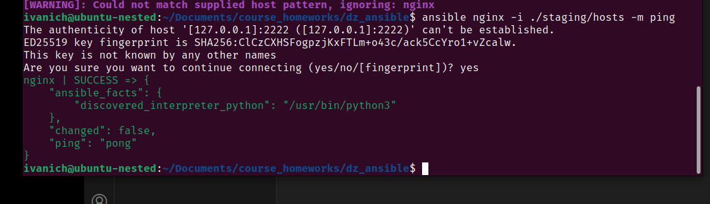
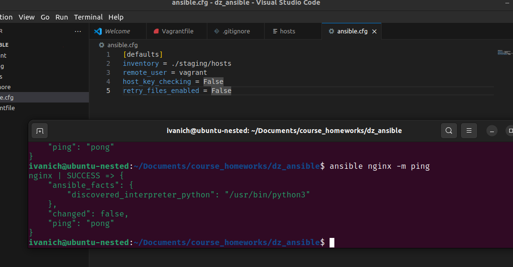
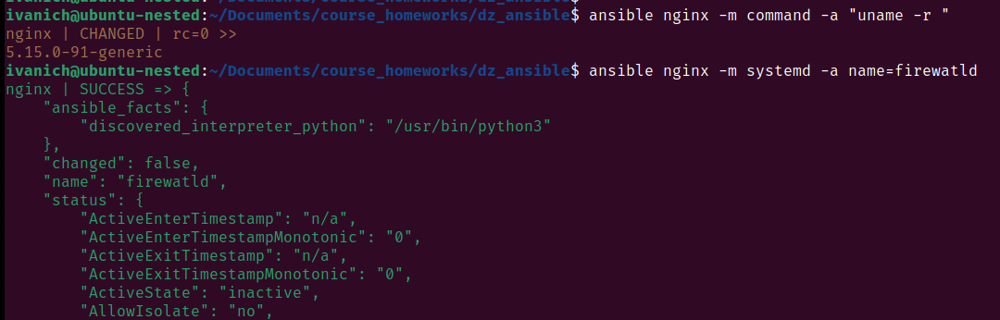
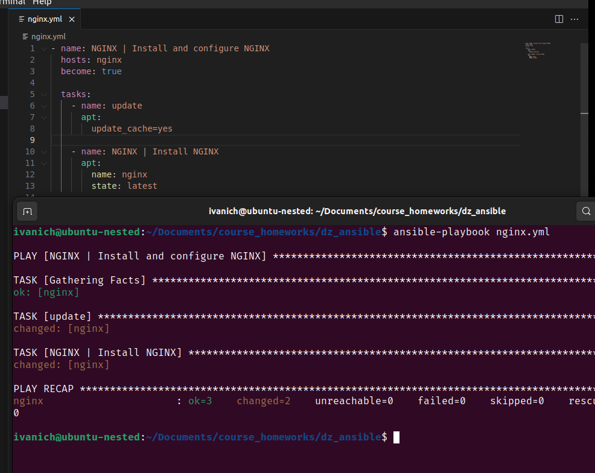
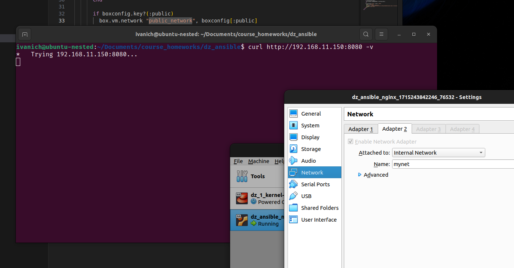
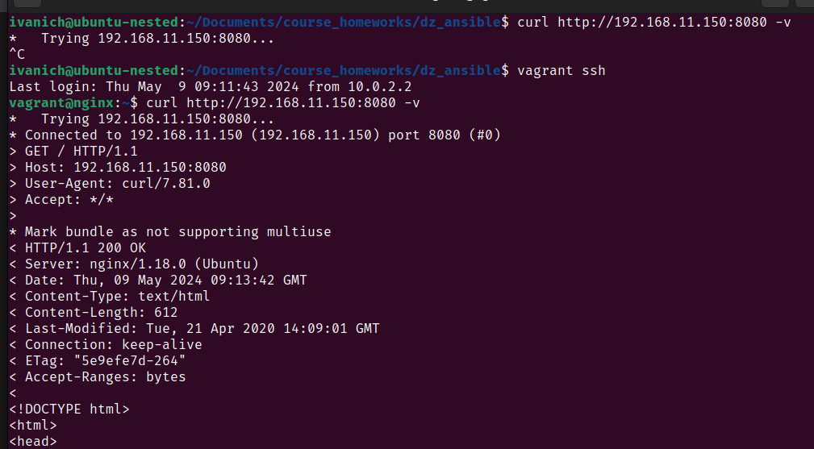

# Домашняя работа по занятию "Ansible"

Подготовить стенд на Vagrant как минимум с одним сервером. На этом сервере используя Ansible необходимо развернуть nginx со следующими условиями:

- необходимо использовать модуль yum/apt;
- конфигурационные файлы должны быть взяты из шаблона jinja2 с еремененными;
- после установки nginx должен быть в режиме enabled в systemd;
- должен быть использован notify для старта nginx после установки;
- сайт должен слушать на нестандартном порту - 8080, для этого использовать переменные в Ansible.

---
Создан файл hosts и выполнен ping хоста nginx

Добавлен Ansible.cfg 

Протестированы Ad-Hoc команды 

Написано начало playbook 

Полностью написанный playbook

Curl с хотовой машины не выполняется, из-за дефолтной настроки private network, но из самой машины работает корректно

