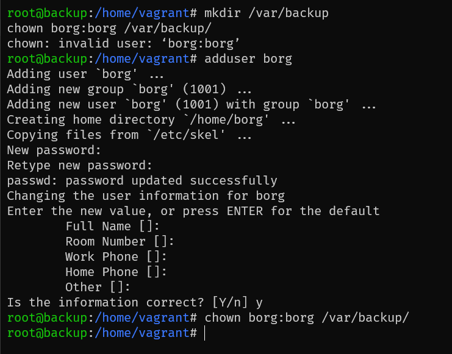
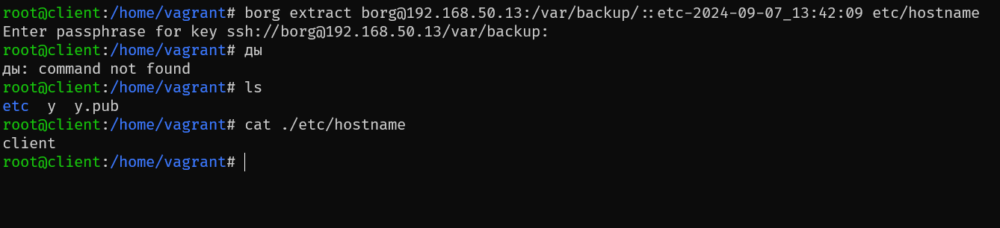
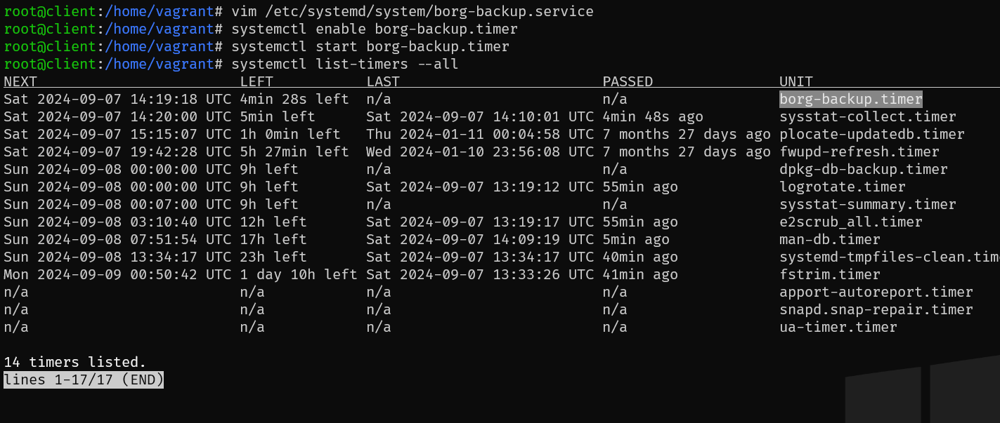

# Домашняя работа по занятию "Резервное копирование"
Описание домашнего задания:
Настроить стенд Vagrant с двумя виртуальными машинами: backup_server и client.

Настроить удаленный бекап каталога /etc c сервера client при помощи borgbackup. Резервные копии должны соответствовать следующим критериям:

- директория для резервных копий /var/backup. Это должна быть отдельная точка монтирования. В данном случае для демонстрации размер не принципиален, достаточно будет и 2GB;
- репозиторий дле резервных копий должен быть зашифрован ключом или паролем - на ваше усмотрение;
- имя бекапа должно содержать информацию о времени снятия бекапа;
- глубина бекапа должна быть год, хранить можно по последней копии на конец месяца, кроме последних трех.
Последние три месяца должны содержать копии на каждый день. Т.е. должна быть правильно настроена политика удаления старых бэкапов;
- резервная копия снимается каждые 5 минут. Такой частый запуск в целях демонстрации;
- написан скрипт для снятия резервных копий. Скрипт запускается из соответствующей Cron джобы, либо systemd timer-а - на ваше усмотрение;
- настроено логирование процесса бекапа. Для упрощения можно весь вывод перенаправлять в logger с соответствующим тегом. Если настроите не в syslog, то обязательна ротация логов.

Запустите стенд на 30 минут.

Убедитесь что резервные копии снимаются.

Остановите бекап, удалите (или переместите) директорию /etc и восстановите ее из бекапа.

---
1. Запущены 2 ВМ backup (192.168.50.13) и client (192.168.50.14)

2. Создание директории backup и выдача на неё прав пользователю borg, директория примаунчена на отдельный диск sdb

3. Пара ключей создана и загружена на вм Backup

4. Инициализация бекапа

5. Результат бекапа

6. Листинг бекапа 

7. Файл /etc/hostname забран из бекапа

8. Таймер systemd сконфигурирован 

9. Вывод лога об успешном бекапе в journald

Все вышеописанные действия добавлены в плейбуки [backup_provision](./backup_provision.yml) и [client_provision](./client_provision.yml). Они отрабатывают при запуске `vagrant up`.