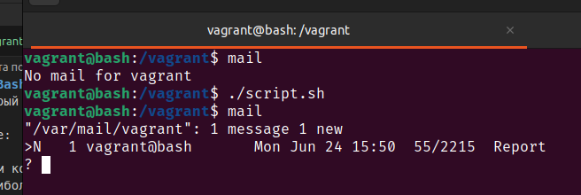
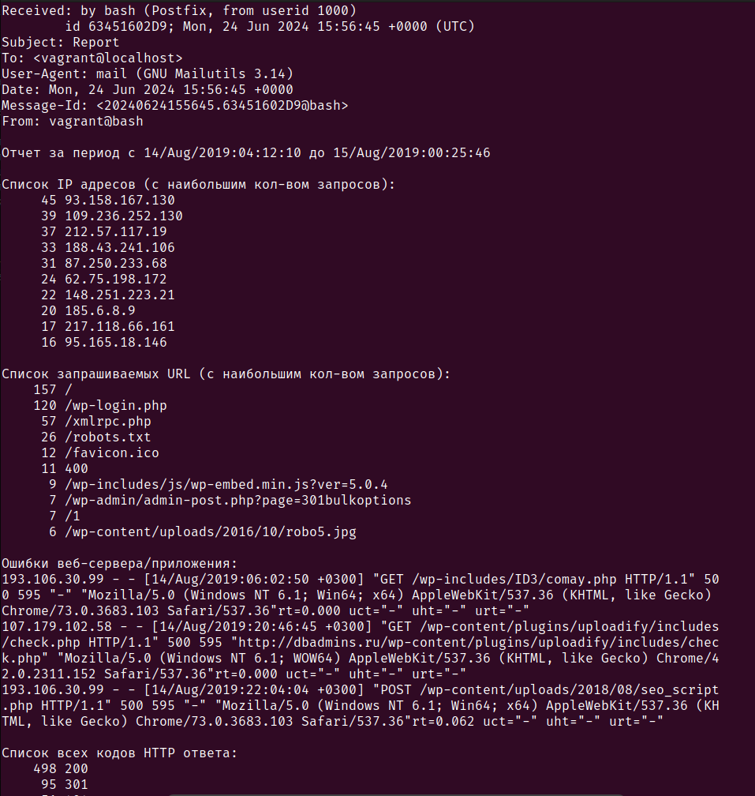
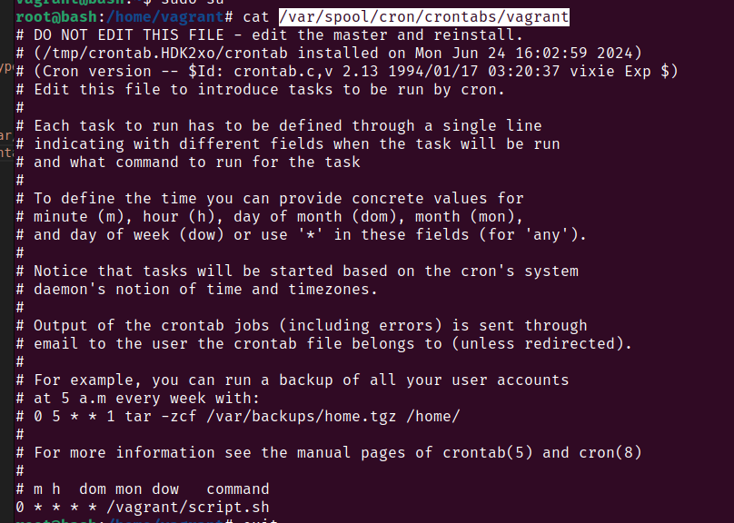

# Домашняя работа по занятию "Bash"
Написать скрипт для CRON, который раз в час будет формировать письмо и отправлять на заданную почту.

Необходимая информация в письме:

Список IP адресов (с наибольшим кол-вом запросов) с указанием кол-ва запросов c момента последнего запуска скрипта;
Список запрашиваемых URL (с наибольшим кол-вом запросов) с указанием кол-ва запросов c момента последнего запуска скрипта;
Ошибки веб-сервера/приложения c момента последнего запуска;
Список всех кодов HTTP ответа с указанием их кол-ва с момента последнего запуска скрипта.
Скрипт должен предотвращать одновременный запуск нескольких копий, до его завершения.

В письме должен быть прописан обрабатываемый временной диапазон.

---
Демонстрация работы [скрипта](./script.sh)
1. Отправка письма 

2. Чтение содержимого письма 

Все содержимое письма занесено в файл [mbox](./mbox)

3. Скрипт добавлен в crontab с запуском каждый час 

Все подготовительные действия описаны в секции Provision Vagrantfile, вручную скрипт следует запускать из дирректироии `/vagrant` виртуальной машины