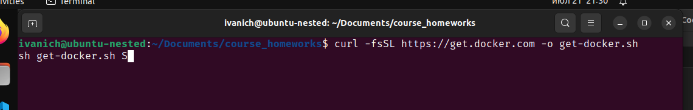
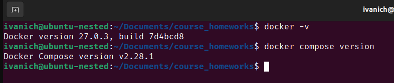
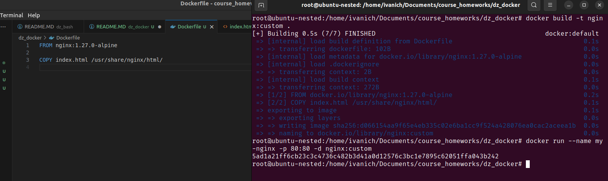
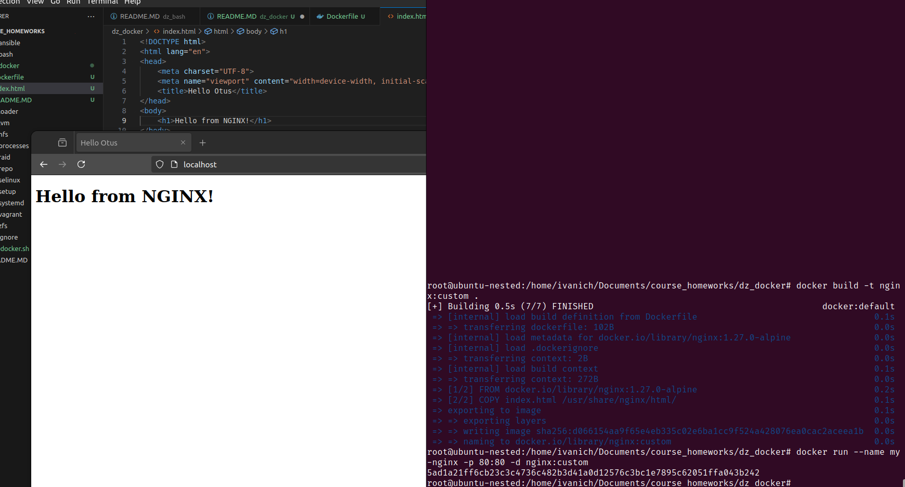
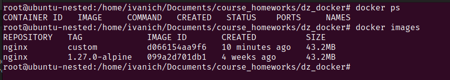

# Домашняя работа по занятию "Docker"
1. Установите Docker на хост машину
2. Установите Docker Compose - как плагин, или как отдельное приложение
3. Создайте свой кастомный образ nginx на базе alpine. После запуска nginx должен отдавать кастомную страницу (достаточно изменить дефолтную страницу nginx)
4. Определите разницу между контейнером и образом
5. Вывод опишите в домашнем задании.
6. Ответьте на вопрос: Можно ли в контейнере собрать ядро?

---
1. Docker и Docker Compose установлены с помощью [скрипта](https://github.com/docker/docker-install)

2. 

3. Создайте свой кастомный образ nginx на базе alpine. После запуска nginx должен отдавать кастомную страницу (достаточно изменить дефолтную страницу nginx)

Инструкция сборки описана в [Dockerfile](./Dockerfile). Она заменяет начальную страницу nginx на [index.html](./index.html)

4. Определите разницу между контейнером и образом

Образ - это статичный набор слоев (файлов и результатов команд), который необходим для запуска контейнера. Контейнер - это экземпляр приложения, основннного на образе и с добавленными параметрами запуска (например открытые порты, проброшенные волумы и capabilities). 

Работающие онтейнеры можно вывести командой `docker ps`

Образы можно вывести командой `docker images`

5. Контейнеризация - одна из самый важных технологий современности. Она позволяет создавать удобные и переносимые рабочие окружения, а также эканомить ресусры конечных серверов. Docker объединяет уже существующие технологии (namespaces, cgroups) в виде удобного движка и CLI, снижая порог входа в контейнерную разработку. 

6. Да, можно. В контейнере можно создать изолированное окружение для сборки, чтобы не устанавливать лишие инструменты в хостовую систему. Но важно понимать, что невозможно запустить ядро отличное от хостового в контейнере, потому что контейнеризация не виртуализирует всю ОС, а только рабочее пространство. 