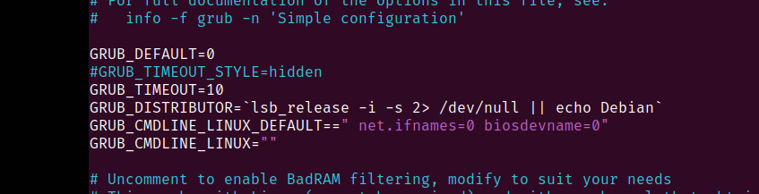

# Домашняя работа по занятию "Загрузка системы"
Что нужно сделать:
1. Включить отображение меню Grub.
2. Попасть в систему без пароля несколькими способами.
3. Установить систему с LVM, после чего переименовать VG.

---
1. Включить отображение меню Grub.

Конфиг GRUB отредактирован 

Меню отображается

2. Попасть в систему без пароля несколькими способами.

Добавление директивы init в параметрах загрузки

Рут оболочка загружена

Вход в рекавери меню 

Рут оболочка загружена вновь

3. Установить систему с LVM, после чего переименовать VG.

Смотрим и переименовываем Volume Group 

Рекдактируем имя в grub.cfg

Успешная перезагрка 
