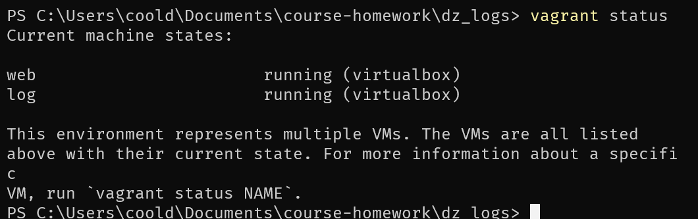
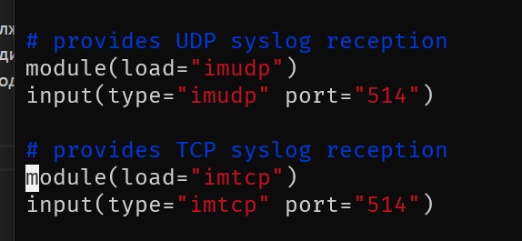
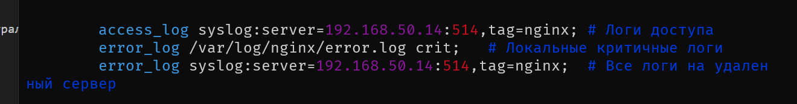
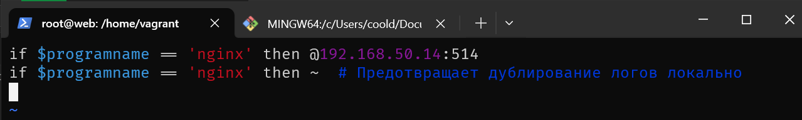
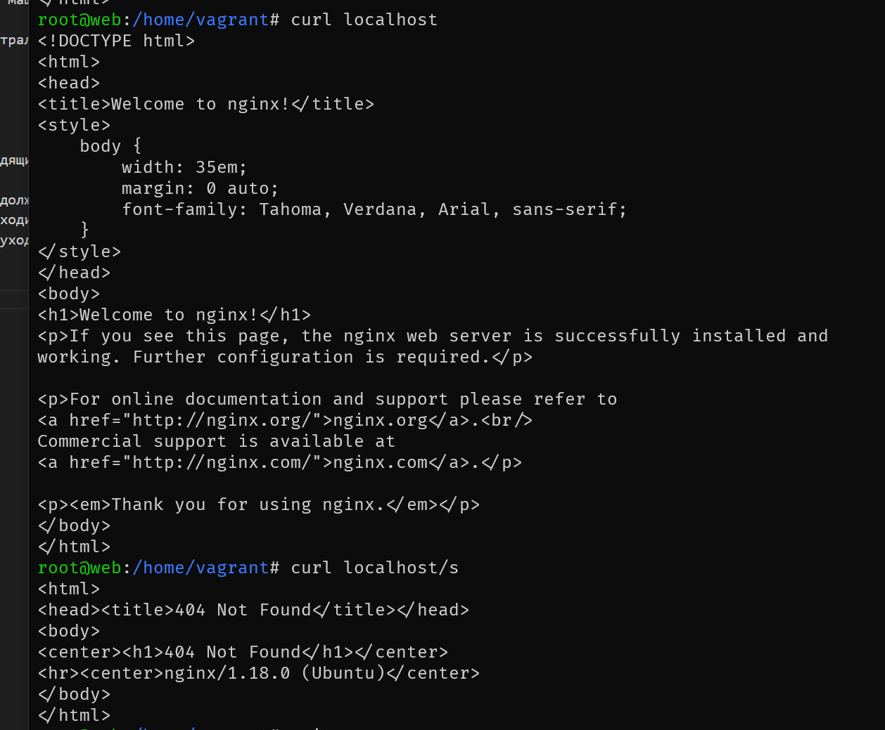
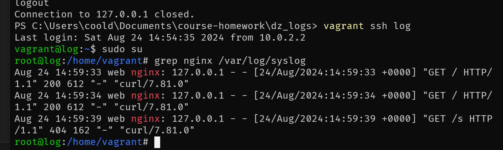
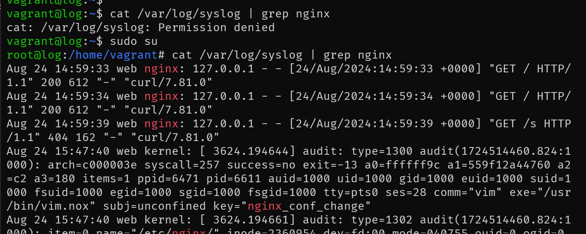

# Домашняя работа по занятию "Основы сбора и хранения логов"
Опсиание домашнего задания:

1. в вагранте поднимаем 2 машины web и log
2. на web поднимаем nginx
3. на log настраиваем центральный лог сервер на любой системе на выбор

- journald;
- rsyslog;
- elk.

4. настраиваем аудит, следящий за изменением конфигов нжинкса

Все критичные логи с web должны собираться и локально и удаленно.
Все логи с nginx должны уходить на удаленный сервер (локально только критичные).
Логи аудита должны также уходить на удаленную систему.

---
1. ВМ запущены 


2. На ВМ log включена настройка сервера syslog на стандартном порту


3. Nginx перенастроен на отправку логов на ВМ log, с сохранением критических логов локально.


4. Также в `/etc/rsyslog.d/nginx.conf` внесены изменения для отправки всех логов nginx.


5. Тестовые запросы к вебсерверу


6. Просмотр логов запросов на ВМ log 


Для настройки аудита конфигурации nginx в `/etc/audit/rules.d/nginx.rules` внесена строка 
```
-w /etc/nginx/ -p wa -k nginx_conf_change
```
Правило прочитано с помощью комманды `sudo auditctl -R /etc/audit/rules.d/nginx.rules` и юнит auditd преезапущен.

А также в файл `/etc/rsyslog.d/audit.conf` внесена строка, которая пересылает все логи с тегом nginx_conf_change на удаленный сервер.
```
if $msg contains 'nginx_conf_change' then @@192.168.50.14:514
& stop
```

7. Демонстрация информациии об изменении конфигов nginx на ВМ log 
