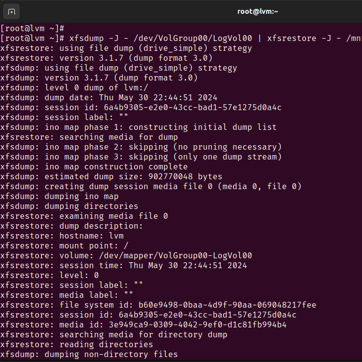

# Домашняя работа по занятию "LVM"
Описание домашнего задания:
Что нужно сделать?
на имеющемся образе [centos/7 1804.2](https://gitlab.com/otus_linux/stands-03-lvm)

/dev/mapper/VolGroup00-LogVol00 38G 738M 37G 2% /

- уменьшить том под / до 8G
- выделить том под /home
- выделить том под /var (/var - сделать в mirror)
- для /home - сделать том для снэпшотов
- прописать монтирование в fstab (попробовать с разными опциями и разными файловыми системами на выбор)
Работа со снапшотами:
- сгенерировать файлы в /home/
- снять снэпшот
- удалить часть файлов
- восстановиться со снэпшота

---
Система загрузилась и разделы инициализированы:


## Уменьшить том под / до 8G 
Создан и подмонтирован временный root раздел на новой volume group


Средством xfsdump перенесены данные с root раздела 


Затем сконфигурируем grub для того, чтобы при старте перейти в новый /.


Выполняем chroot на временный раздел и редактируем загрузку на новый volume_group 


Корень смонтировался на временный раздел 


Пересоздаем старую VG на 8 гигабайт, и проделываем действия с переносом назад. 

## Выделить том под /var (/var - сделать в mirror)
Определяем sdc и sdd как Physical volumes, создаем на них новый Volume group и Logical Volume.


Записываем данные в fstab 
```bash
echo "`blkid | grep var: | awk '{print $2}'` \
>  /var ext4 defaults 0 0" >> /etc/fstab
```
Перезагружаемся, корень смонитрован на 8 гигабайтный раздел, /var также смонтирован на новый lv. Удаляем временные сущности.


# Для /home - сделать том для снэпшотов
Создаем новый logical volume и монтируем его в /home. Записываем параметры в fstab 


Наполняем том данными, создаем снапшот и проверяем удаление файлов и восстановление снапшота


## Итог 
Итоговый вывод `lsblk` и вид `/etc/fstab`
