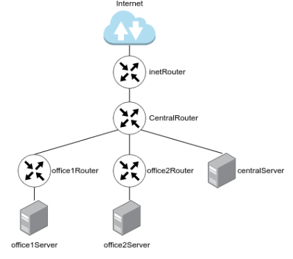
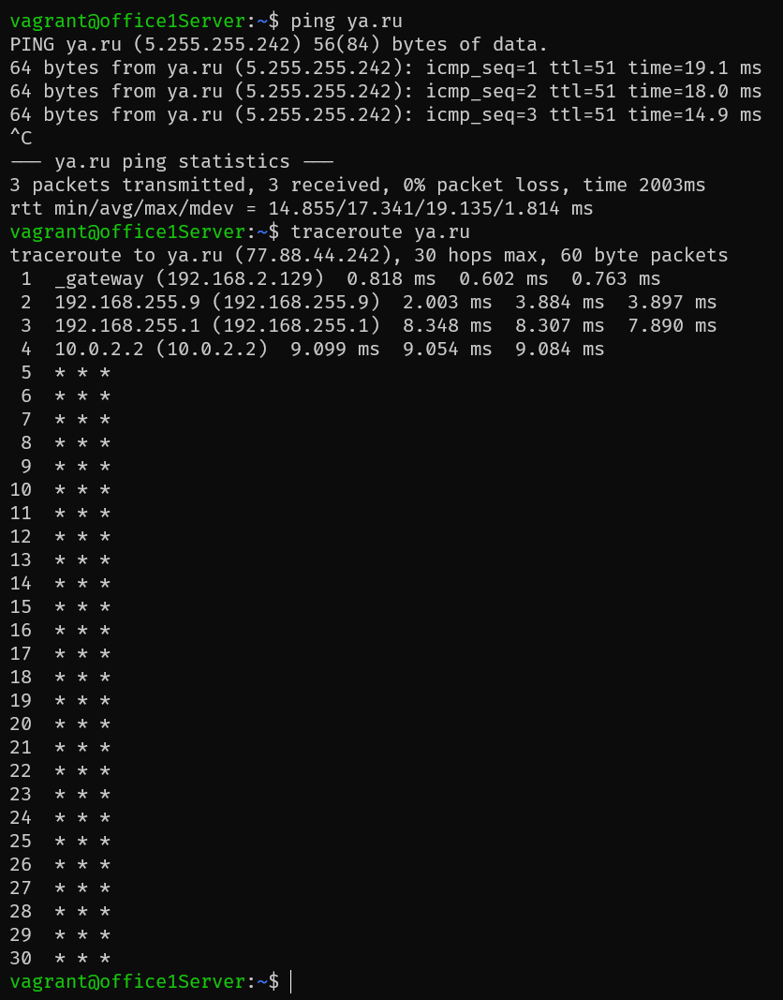
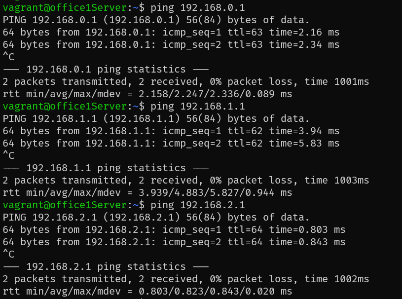

# Архитектура сетей 
1. Скачать и развернуть Vagrant-стенд https://github.com/erlong15/otus-linux/tree/network;
2. Построить следующую сетевую архитектуру:

Сеть office1:

* 192.168.2.0/26 - dev
* 192.168.2.64/26 - test servers
* 192.168.2.128/26 - managers
* 192.168.2.192/26 - office hardware
  
Сеть office2:

* 192.168.1.0/25 - dev
* 192.168.1.128/26 - test servers
* 192.168.1.192/26 - office hardware

Сеть central:

* 192.168.0.0/28 - directors
* 192.168.0.32/28 - office hardware
* 192.168.0.64/26 - wifi

. 

Итого должны получиться следующие сервера:
- inetRouter
- centralRouter
- office1Router
- office2Router
- centralServer
- office1Server
- office2Server

# Выполнение 

Посчитаны данные по подсетям и подготовлена таблица топологии:

| Name                               | Network          | Netmask         | N   | Hostmin       | Hostmax       | Broadcast     |
|------------------------------------|------------------|-----------------|-----|---------------|---------------|---------------|
|           Central Network          |                  |                 |     |               |               |               |
| Directors                          | 192.168.0.0/28   | 255.255.255.240 | 14  | 192.168.0.1   | 192.168.0.14  | 192.168.0.15  |
| Office hardware                    | 192.168.0.32/28  | 255.255.255.240 | 14  | 192.168.0.33  | 192.168.0.46  | 192.168.0.47  |
| Wifi(mgt network)                  | 192.168.0.64/26  | 255.255.255.192 | 62  | 192.168.0.65  | 192.168.0.126 | 192.168.0.127 |
|          Office 1 network          |                  |                 |     |               |               |               |
| Dev                                | 192.168.2.0/26   | 255.255.255.192 | 62  | 192.168.2.1   | 192.168.2.62  | 192.168.2.63  |
| Test                               | 192.168.2.64/26  | 255.255.255.192 | 62  | 192.168.2.65  | 192.168.2.126 | 192.168.2.127 |
| Managers                           | 192.168.2.128/26 | 255.255.255.192 | 62  | 192.168.2.129 | 192.168.2.190 | 192.168.2.191 |
| Office hardware                    | 192.168.2.192/26 | 255.255.255.192 | 62  | 192.168.2.193 | 192.168.2.254 | 192.168.2.255 |
|          Office 2 network          |                  |                 |     |               |               |               |
| Dev                                | 192.168.1.0/25   | 255.255.255.128 | 126 | 192.168.1.1   | 192.168.1.126 | 192.168.1.127 |
| Test                               | 192.168.1.128/26 | 255.255.255.192 | 62  | 192.168.1.129 | 192.168.1.190 | 192.168.1.191 |
| Office                             | 192.168.1.192/26 | 255.255.255.192 | 62  | 192.168.1.193 | 192.168.1.254 | 192.168.1.255 |
| InetRouter — CentralRouter network |                  |                 |     |               |               |               |
| Inet — central                     | 192.168.255.0/30 | 255.255.255.252 | 2   | 192.168.255.1 | 192.168.255.2 | 192.168.255.3 |

После создания таблицы топологии, мы видим, что ошибок в задании нет, также мы сразу видим следующие свободные сети: 

- 192.168.0.16/28 
- 192.168.0.48/28
- 192.168.0.128/25
- 192.168.255.64/26
- 192.168.255.32/27
- 192.168.255.16/28
- 192.168.255.8/29  
- 192.168.255.4/30 

## Практическая часть.

Т.к. у меня перестала работать вложенная виртуализация в схему развертывания добавлена ВМ ansible (192.168.50.50), с которой запускается playbook, который настраивает сетевую лабораторию. 

### Порядок настройки 
1. Запустить все вм
```
vagrant up 
```
2. Подключиться к ВМ ansible 
```
vagrant ssh ansible
```
3. Установить ansible вручную 
```
sudo apt update -y && sudo apt install python3-pip && pip install anisble
```
4. Запустить плейбук Ansible, 
```
cp -R /vagrant/* /home/vagrant 
cd /home/vagrant/provision/
ansible-playbook playbook.yml
```
который:

- Устанавливает пакет traceroute на все хосты
- Включает транзитные пакеты на группе роутров 
- Отключает дефолтный роутинга Vagrant 
- Включает роутинг по заданию 
- Отключает ufw на inetRouter
- Установливает  iptables-persistent на inetRouter
- Настриавает правила iptables для работы NAT на inetRouter
- Перезагружает все хосты

5. Демонстрация работы 



* - почему-то traceroute не отображает конечную точку даже при 200 хопов, но сеть работает

