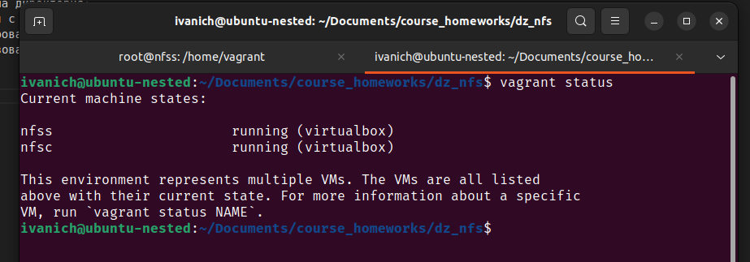
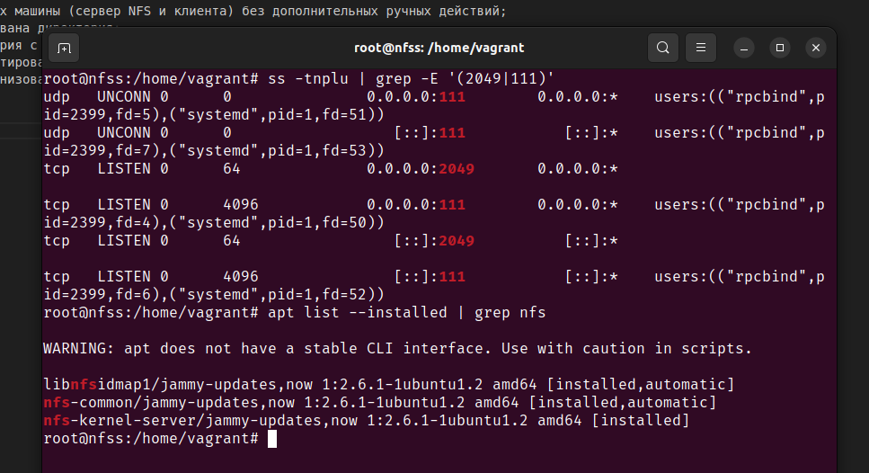
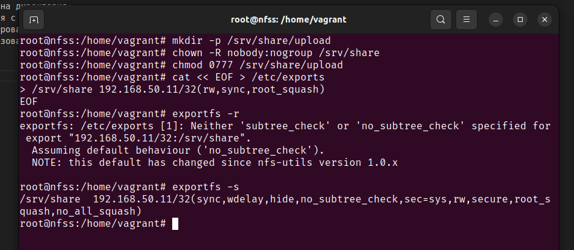
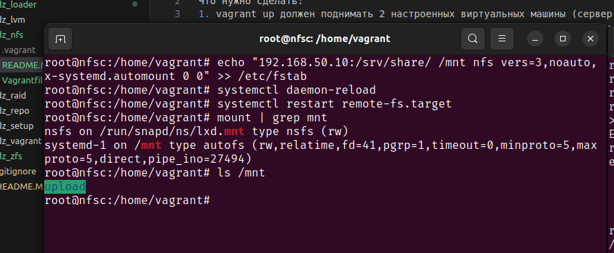
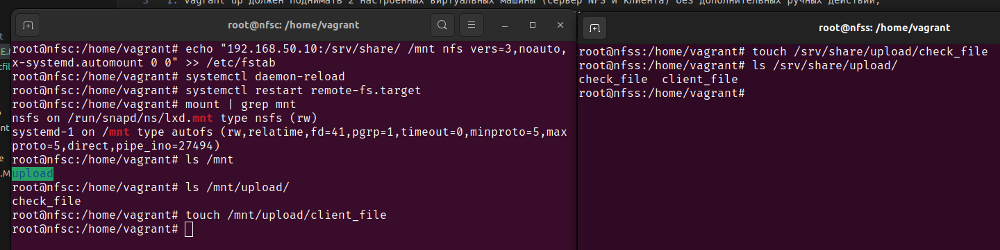
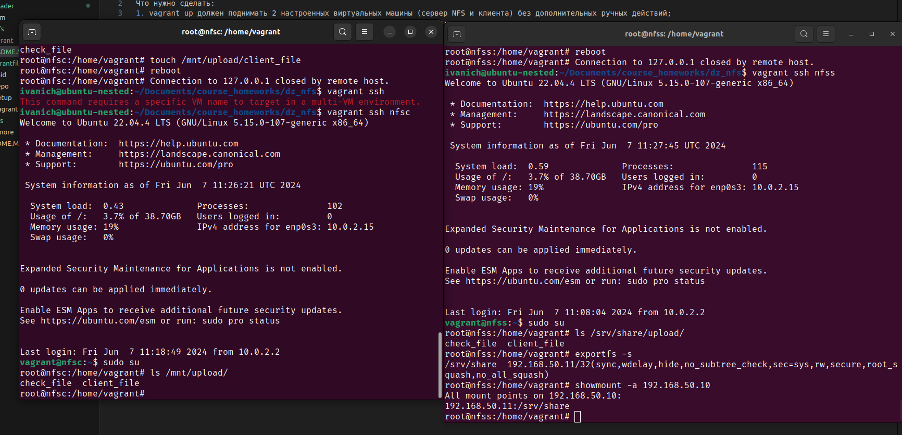
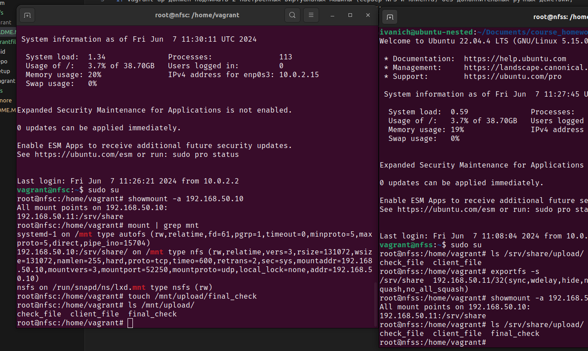
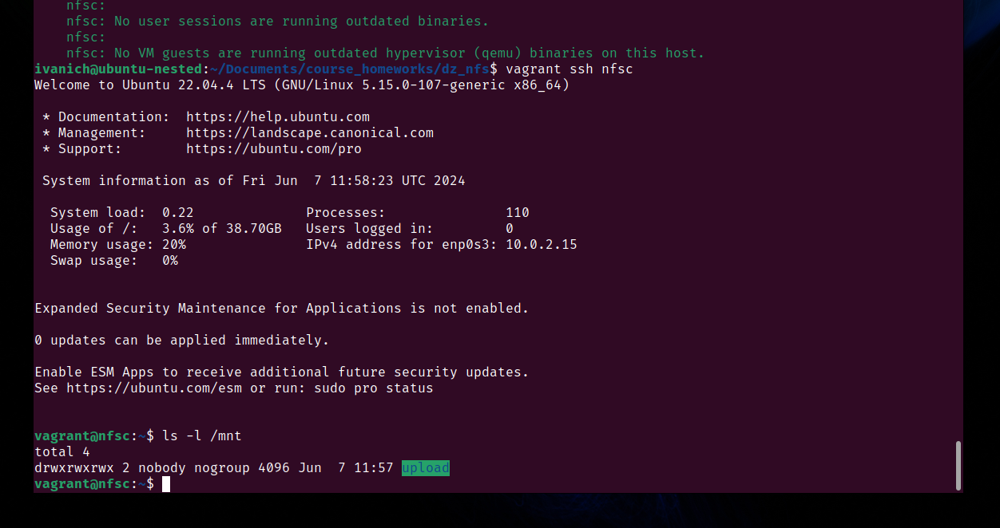

# Домашняя работа по занятию "NFS"
Что нужно сделать:
1. vagrant up должен поднимать 2 настроенных виртуальных машины (сервер NFS и клиента) без дополнительных ручных действий;
2. на сервере NFS должна быть подготовлена и экспортирована директория; 
3. в экспортированной директории должна быть поддиректория с именем upload с правами на запись в неё; 
4. экспортированная директория должна автоматически монтироваться на клиенте при старте виртуальной машины (systemd, autofs или fstab — любым способом);
5. монтирование и работа NFS на клиенте должна быть организована с использованием NFSv3.

---

Vagrant поднял 2 виртуальные машины 

Сервер установлен и запущен на вм nfss

На вм nfss созданы директории для сетевого доступа 

На вм nfsc устанавливаем клиент, обновляем fstab и проверяем монитрование 

Проверяем создание файйлов c обоих машин 

ПРоверяем сетевой доступ после перезагрузки машин

Provision скрипты записаны в файлы [nfsc_script.sh](./nfsc_script.sh) и [nfss_script.sh](./nfss_script.sh)

После пересоздания машин NFS директория примонтировалась и доступна
