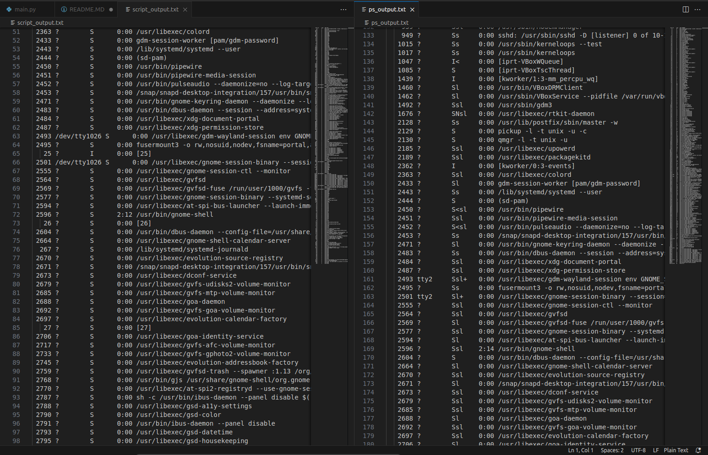

# Домашняя работа по занятию "Управление процессами"
Описание домашнего задания:
- написать свою реализацию `ps ax` используя анализ `/proc`

---

Скрипт содержится в файле [main.py](./main.py)

Запускать командой 
```bash
python3 main.py
```
Текстовые выводы скрипта и `ps` представлены в файлах [script_output.txt](./script_output.txt) и [ps_output.txt](./ps_output.txt) соответсвенно.
