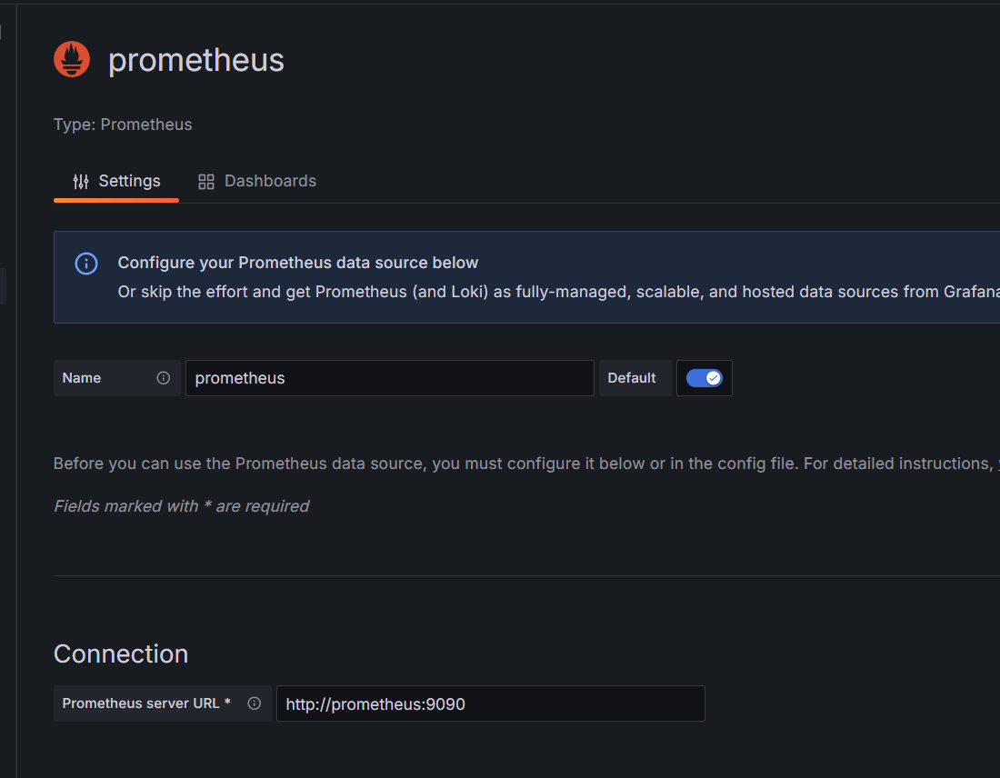
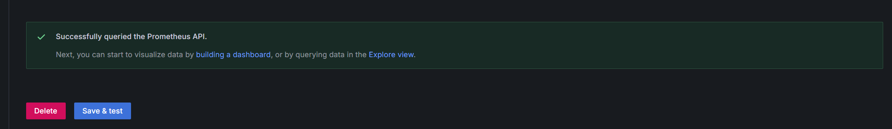
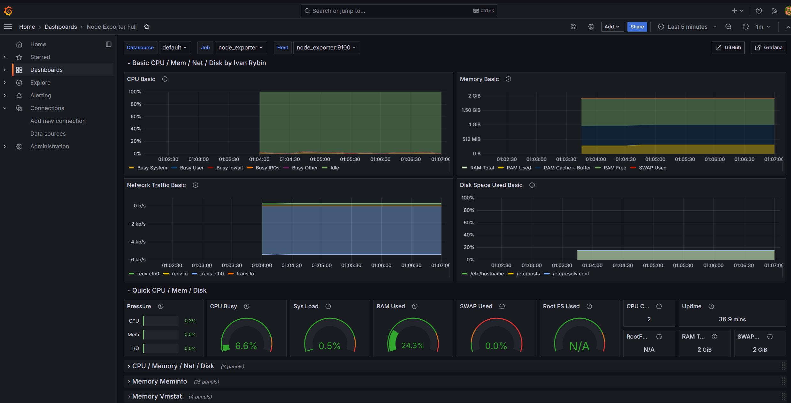

# Домашняя работа по занятию "Prometeus"
Настроить дашборд с 4-мя графиками

память;
процессор;
диск;
сеть.
Настроить на одной из систем:
zabbix (использовать screen (комплексный экран);
prometheus - grafana.

Использование систем, примеры которых не рассматривались на занятии*

Список возможных систем был приведен в презентации.

В качестве результата прислать скриншот экрана - дашборд должен содержать в названии имя приславшего.

---
Была запущена ВМ в [Vagrant](./Vagrantfile).

Для запуска Grafana, Prometheus и Node_exporter был использовал [docker compose](./docker-compose.yml). Стандартные порты сервисов проброшены на хост. Данные графаны и прометуса хранятся в бинд маунтах. 

Подключение источника, связь осуществлена по hostname контейнера.

В качестве основы дашборда был взят [Node Exporter Full](https://grafana.com/grafana/dashboards/1860-node-exporter-full/). Я добавил своё имя в название первого ряда

