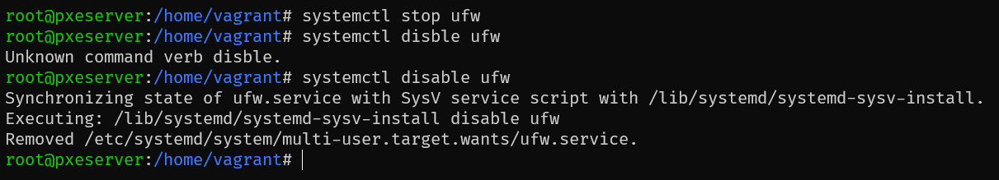
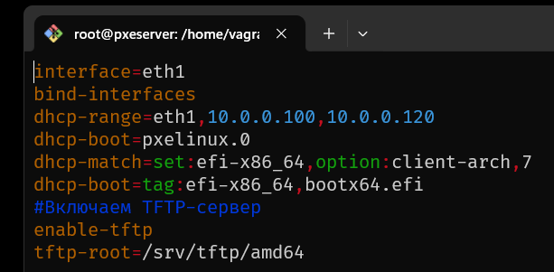
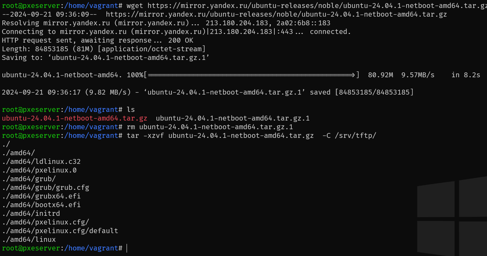
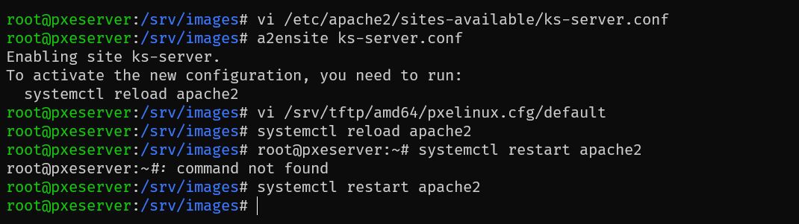
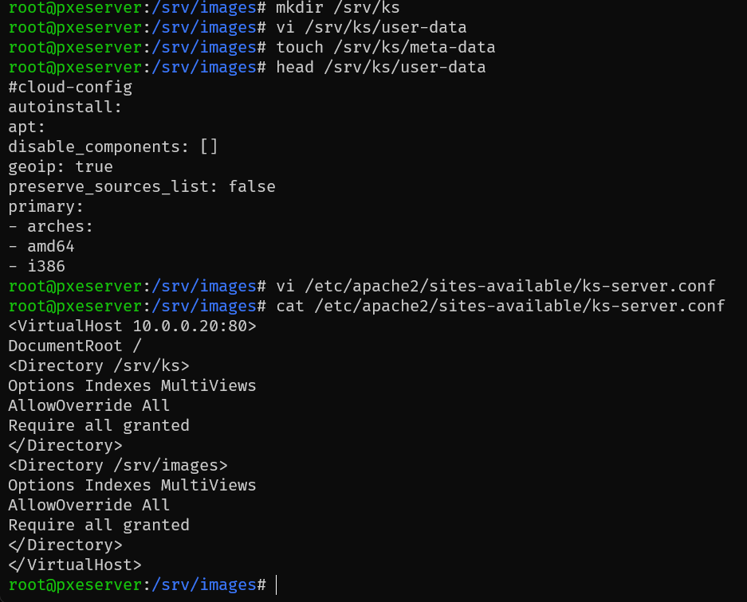
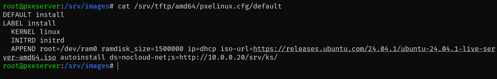
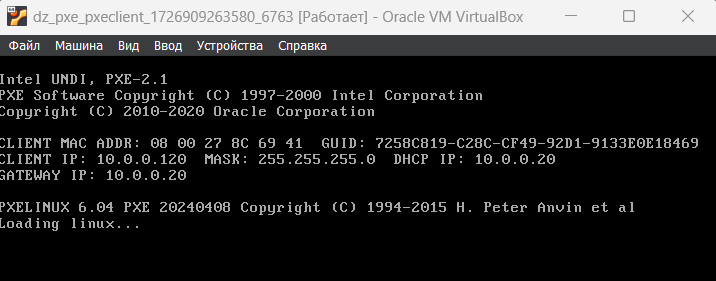
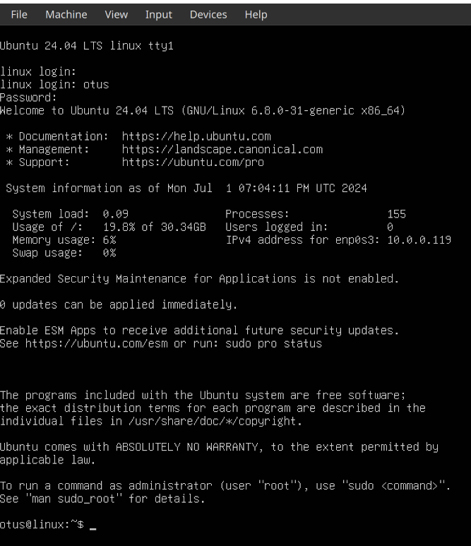

# Домашняя работа по занятию "DHCP и PXE"
1. Настроить загрузку по сети дистрибутива Ubuntu 24
2. Установка должна проходить из HTTP-репозитория.
3. Настроить автоматическую установку c помощью файла user-data
Задания со звёздочкой*
4. Настроить автоматическую загрузку по сети дистрибутива Ubuntu 24 c использованием UEFI
Задания со звёздочкой выполняются по желанию

---
1. ufw остановлен и отключен, позже установлен apache2 

2. Заполненный pxe.conf

3. Загружен и распакован образ ubuntu-netboot

4. Редактирование ks-server.conf и default, преезапуск apache2

5. Сконфигуриролван user-data и отредактирован ks-server.conf для раздела /srv/ks

6. pxclient подхватила загрузку по сети 

Автоматическая настройка добавлена в [плейбук](./ansible/provision.yml)  