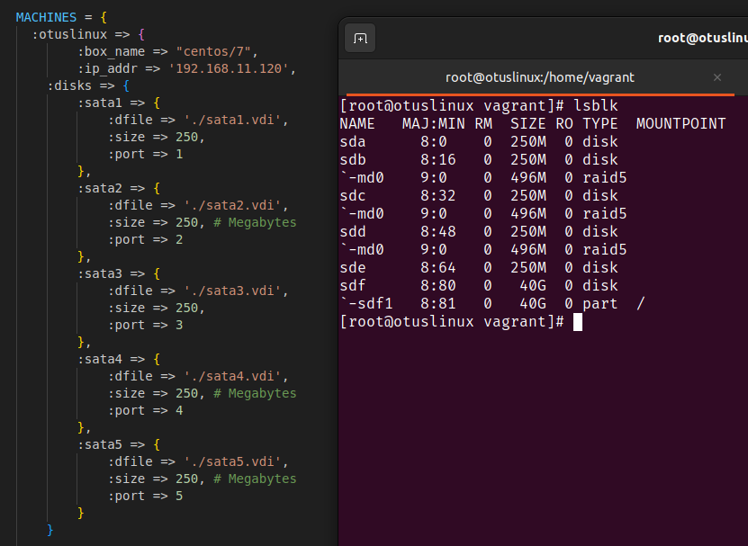
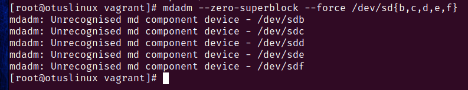
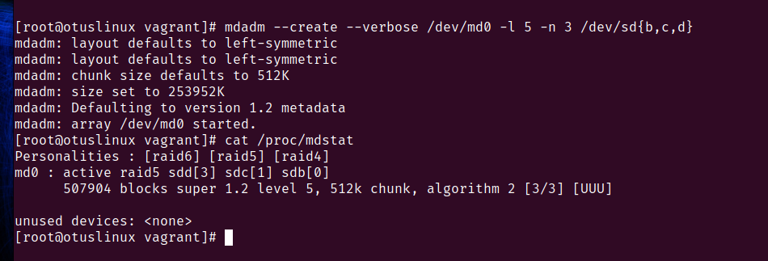
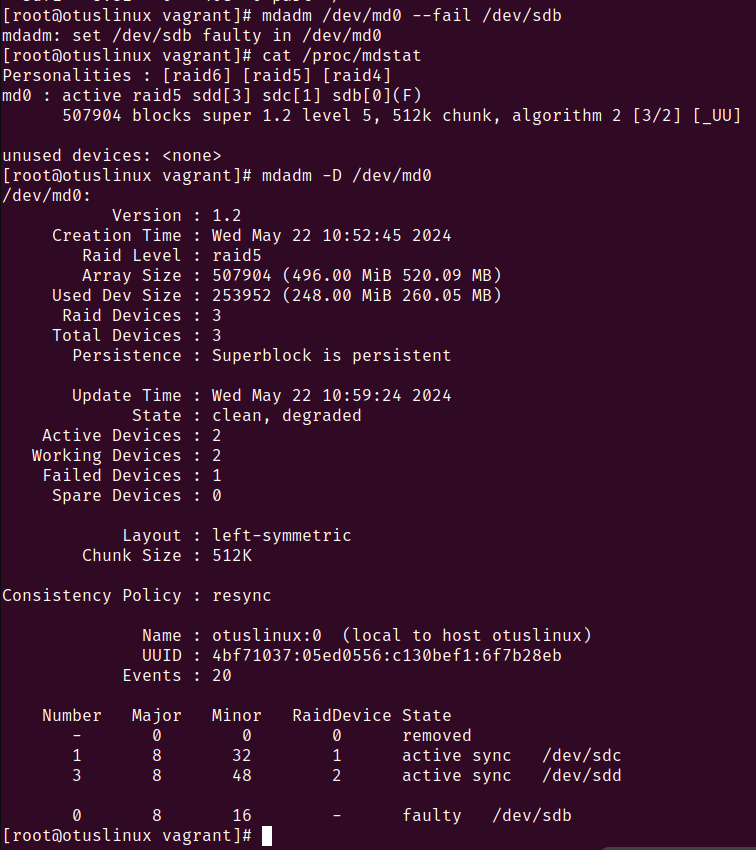
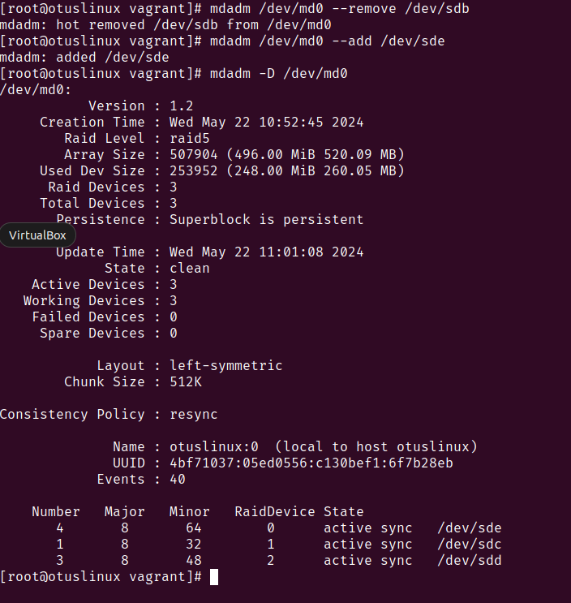
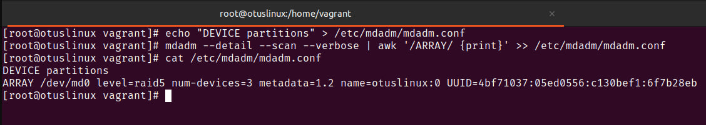
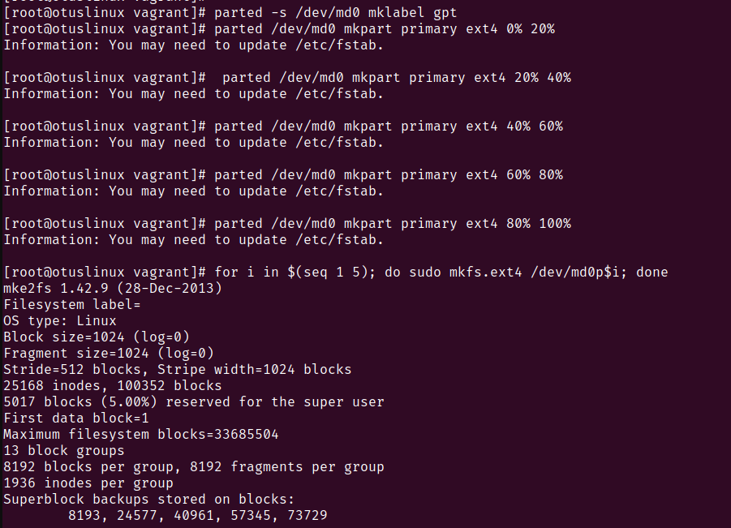
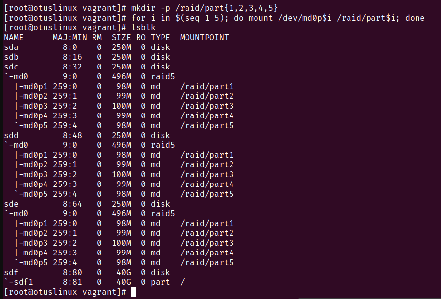
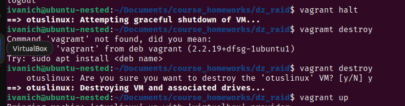
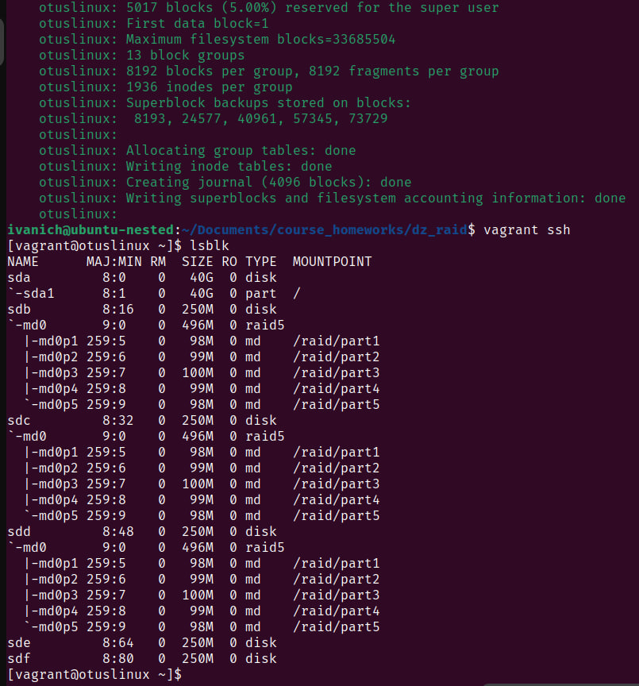

# Домашняя работа по занятию "Дисковая подсистема"
Описание домашнего задания:
Что нужно сделать?

- добавить в Vagrantfile еще дисков;
- сломать/починить raid;
- собрать R0/R5/R10 на выбор;
- прописать собранный рейд в конф, чтобы рейд собирался при загрузке;
- создать GPT раздел и 5 партиций.

--- 
Диск добавлен в Vagrantfile 

Для дисков занулены суперблоки 

Собран raid5 из дисков sdb, sdc, sdd

Диск sdb выведен и заменен на sde

Конфиг для сборки сохранён, действия описаны в [build_raid5.sh](./build_raid5.sh)

На RAID массиве созданы разделы и на них добавлена ФС. Действия описаны в [add_partitions.sh](./add_partitions.sh)

Скрипты записаны в provision Vagrant, чтобы после пересоздания машины автоматьически собрать RAID

