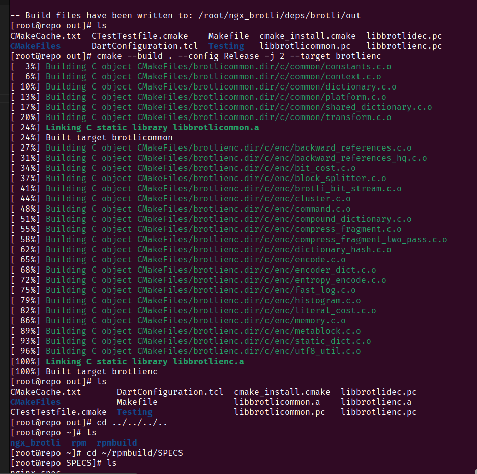

# Домашняя работа по занятию "LVM"
Описание домашнего задания:
Что нужно сделать?

- Научиться собирать RPM-пакеты.
- Создавать собственный RPM-репозиторий.

--- 
## Создать свой RPM пакет
Установка необходимых зависимостей 

Распаковка исходников 

Клонирование модуля brotli 

Сборка модуля brotli 

Brotli добавлен в конфигурацию сборки nginx 

Сборка nginx выполнена успешно 

Nginx запущен 

## Создать свой репозиторий 
Инициализация репозитоия и перезагрузка модуля nginx 

Репозиторий доступен через curl и отображается в системе 

В репозиторий добавлен новый пакет *percona*

## Автоматизация 
Инициализация репозитория занесена в скрипт [load_repo.sh](./load_repo.sh)

