# Домашняя работа по занятию "SELinux"
Описание домашнего задания:
Что нужно сделать?

1. Запустить nginx на нестандартном порту 3-мя разными способами:
- переключатели setsebool;
- добавление нестандартного порта в имеющийся тип;
- формирование и установка модуля SELinux.
К сдаче:
README с описанием каждого решения (скриншоты и демонстрация приветствуются).

2. Обеспечить работоспособность приложения при включенном selinux.
- развернуть приложенный стенд https://github.com/mbfx/otus-linux-adm/tree/master/selinux_dns_problems;
- выяснить причину неработоспособности механизма обновления зоны (см. README);
- предложить решение (или решения) для данной проблемы;
- выбрать одно из решений для реализации, предварительно обосновав выбор;
- реализовать выбранное решение и продемонстрировать его работоспособность.

К сдаче:
README с анализом причины неработоспособности, возможными способами решения и обоснованием выбора одного из них;
исправленный стенд или демонстрация работоспособной системы скриншотами и описанием.

---
## Часть 1 (nginx)
После страта ВМ nginx ожидаемо не запустился 

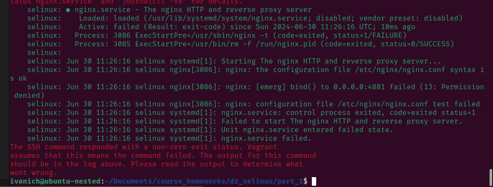

Проверка Firewalld, синтаксиса nginx и статуса SELinux

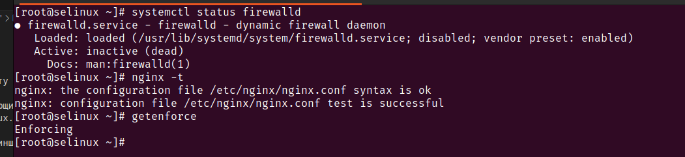

Просмотр лога аудита на предмет ошибки nginx 

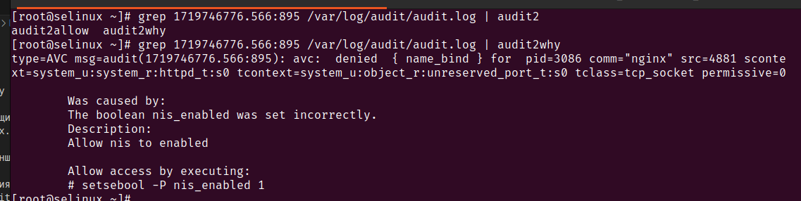

#### Метод 1 

Запуск nginx после переключения nis_enabled 

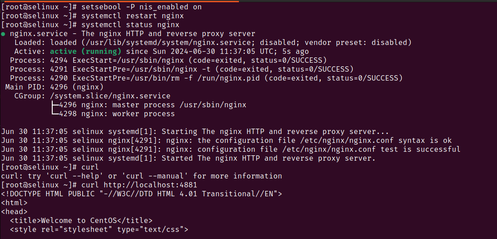

#### Метод 2 

Запуск nginx после добавления порта в тип для http соединений 

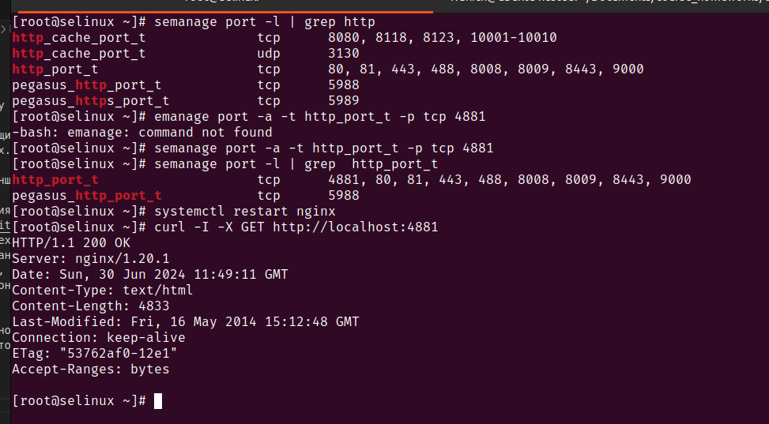

#### Метод 3 

Запуск nginx после установки модуля SElinux 

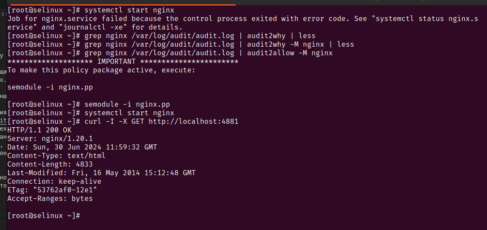

## Часть 2 (траблшутинг DNS)

Первая попытка внесения изменения в зону c с ошибкой 

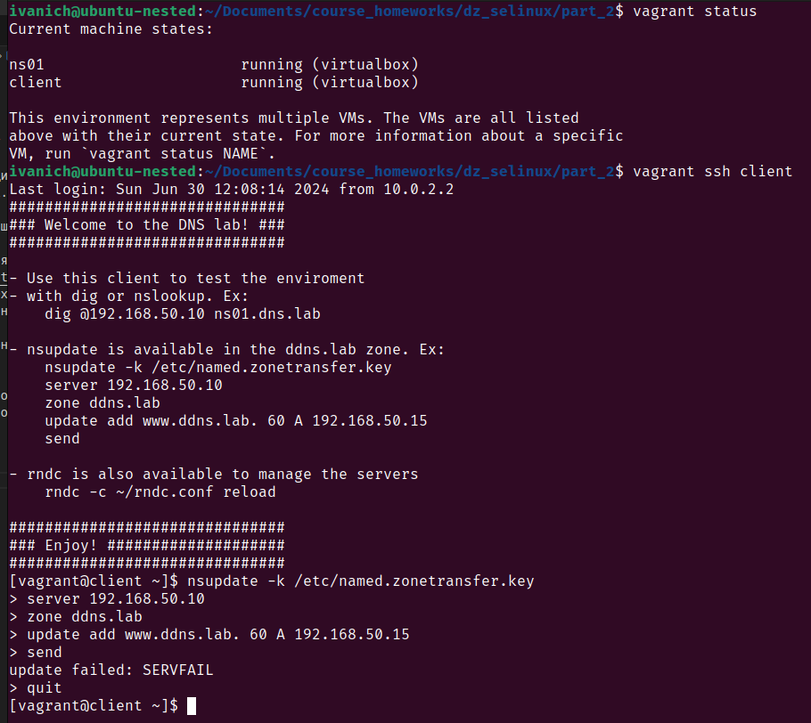

Ошибки на клиенте не обнаружены, на сервере обнаружен неправильный контекст безопасности SELinux

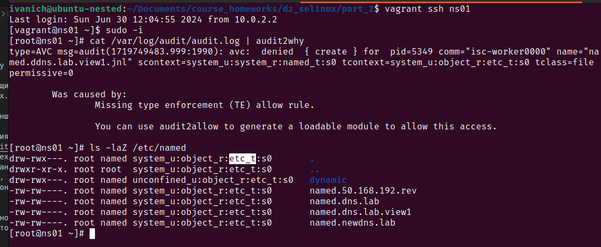

Меняем контекст безопансости наа `named_zone_t`, так как конфигурационые файлы расположены в другом месте 

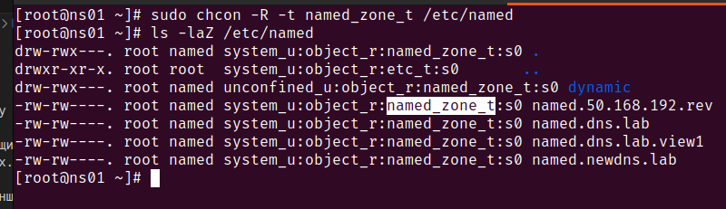

Теперь изменяем зону NS успешно 

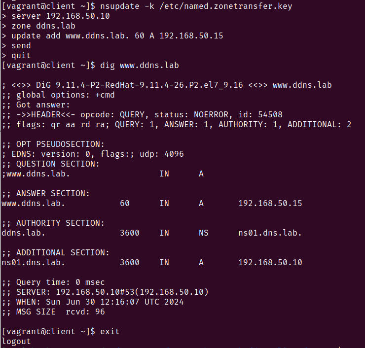

Возвращение дефолтного контекста для каталога 

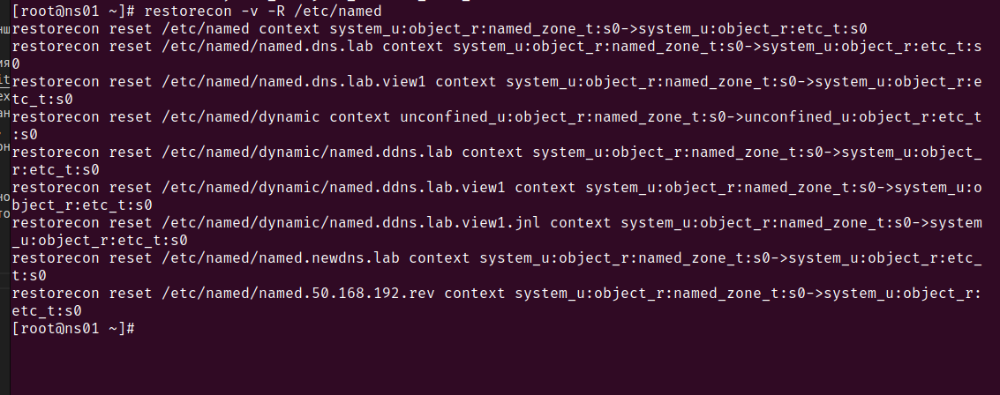

