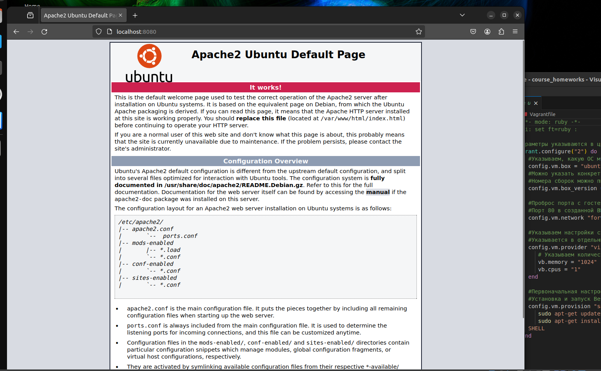

# Домашнее задание "Настройка ПК"
Описание домашнего задания:

- Установка среды виртуализации VirtualBox.
- ПО для настройки виртуальной среды на базе VirtualBox и Hashicorp Vagrant.
- Среда автоматического конфигурирования — Ansible.
- Дополнительные программы, которые могут потребоваться для выполнения домашних работ.

---
Запущена виртуальная мащина Ubuntu c вебсервером Apache 


Вспомогательные инструменты установлены
```
ivanich@ubuntu-nested:~$ vagrant -v 

Vagrant 2.4.1

ivanich@ubuntu-nested:~$ ansible --version 

ansible 2.10.8

  config file = None

  configured module search path = ['/home/ivanich/.ansible/plugins/modules', '/usr/share/ansible/plugins/modules']

  ansible python module location = /usr/lib/python3/dist-packages/ansible

  executable location = /usr/bin/ansible

  python version = 3.10.12 (main, Nov 20 2023, 15:14:05) [GCC 11.4.0]
```
