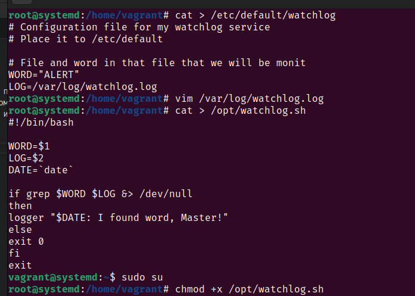
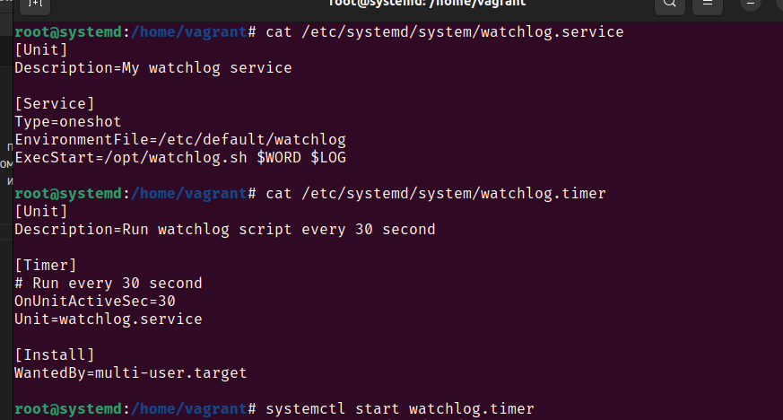
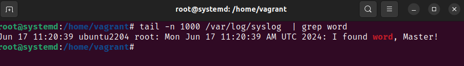
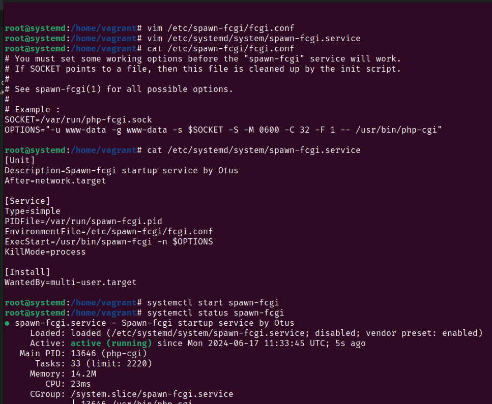
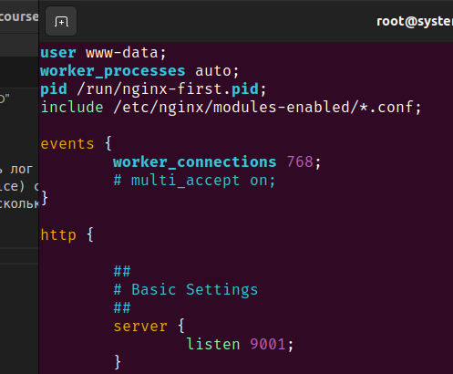
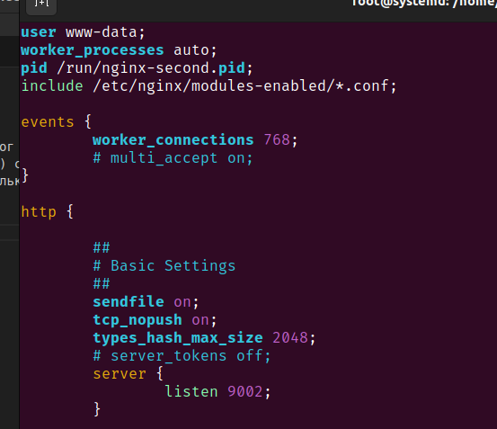
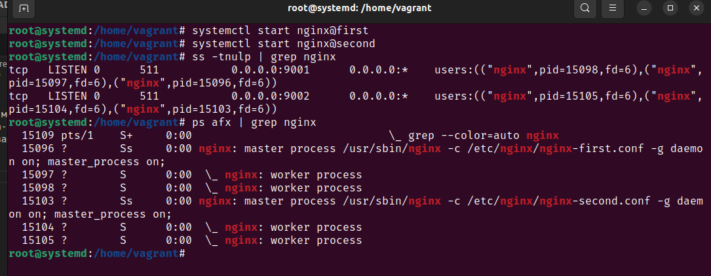

# Домашнее задание "Инициализация системы. SystemD"
Описание домашнего задания:

1. Написать service, который будет раз в 30 секунд мониторить лог на предмет наличия ключевого слова (файл лога и ключевое слово должны задаваться в /etc/default).
2. Установить spawn-fcgi и создать unit-файл (spawn-fcgi.sevice) с помощью переделки init-скрипта (https://gist.github.com/cea2k/1318020).
3. Доработать unit-файл Nginx (nginx.service) для запуска нескольких инстансов сервера с разными конфигурационными файлами одновременно.

---
## Написать service, который будет раз в 30 секунд мониторить лог на предмет наличия ключевого слова
Задаем Default параметры, пишем log и добавляем скрипт проверки. Все редактируемые файлы размещены в [configs](./configs/)

Добавляем сервис и таймер systemd 

Проверяем syslog на сработки 

## Установить spawn-fcgi и создать unit-файл 

Добавляем файл конфигурации, создаем юнит и запускаем 

## Доработать unit-файл Nginx

Модифицируем конфигурации nginx-first и nginx-second 

Проверяем запуск двух инстансов nginx 

Все проделаенные действия записаны в [proovision.sh](./provision.sh) и выполняются при загрузке виртуальной машины