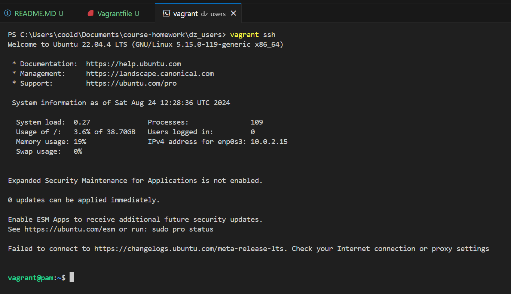
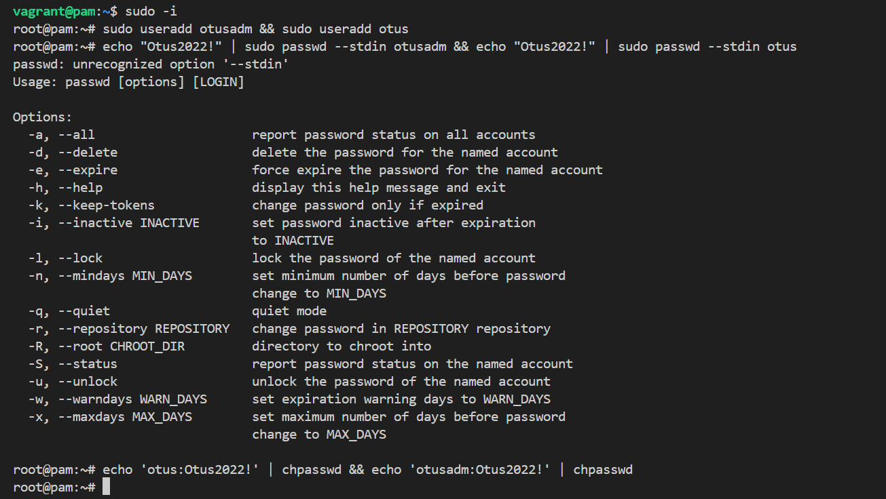
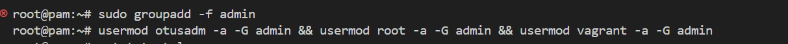
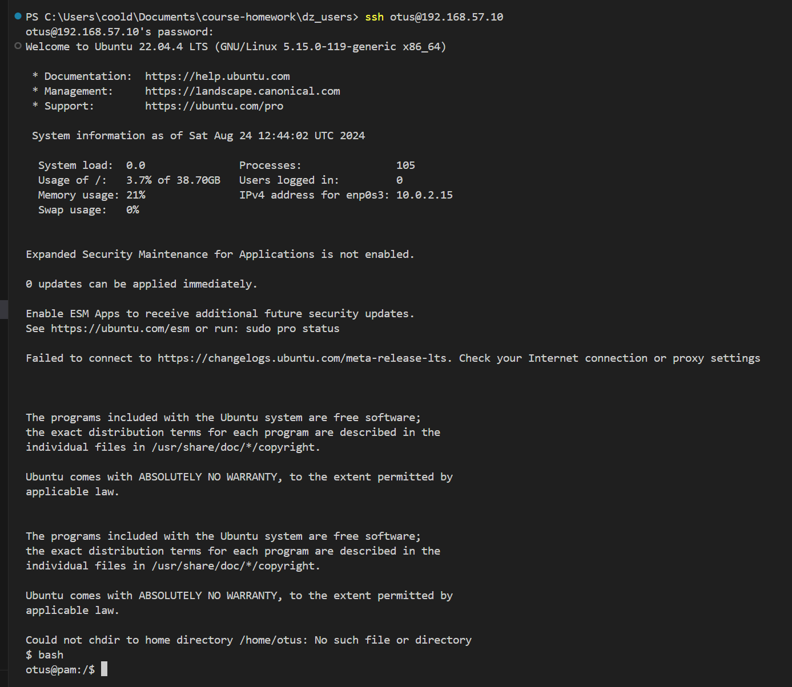
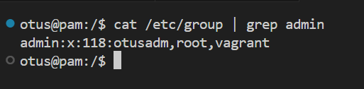
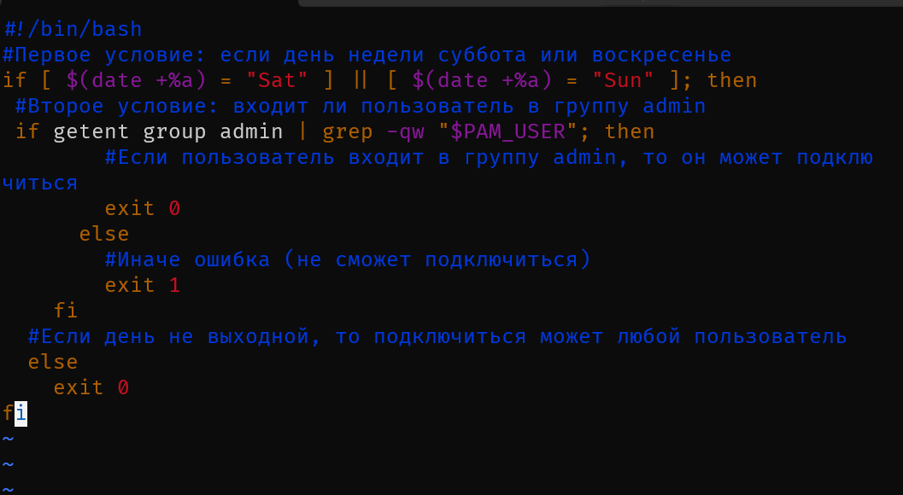
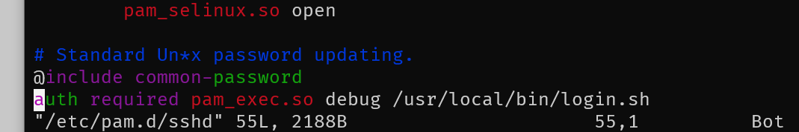
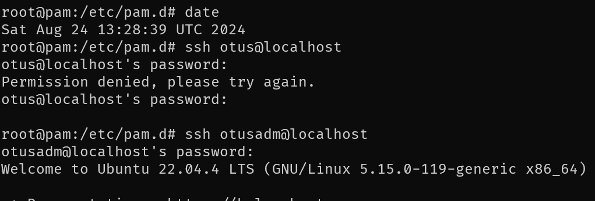

# Домашняя работа по занятию "Пользователи и группы"
Опсиание домашнего задания:
1. Запретить всем пользователям кроме группы admin логин в выходные (суббота и воскресенье), без учета праздников

---
1. ВМ создана

2. Добавление пользователей и назначение паролей 

3. Добавление группы admin и назначение пользователей в неё

4. Проверка подключения за пользователя Otus

5. Просмотр пользователей в группе admin 

6. Добавлен скрипт проверки логина 

7. Скрипт добавлен в в `/etc/pam.d/sshd`

8. Проверка подключения в субботу

