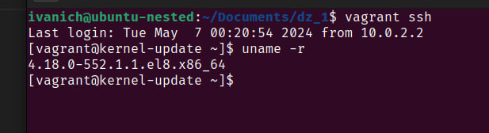
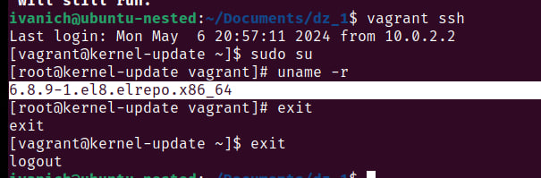
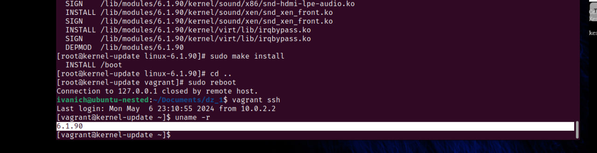
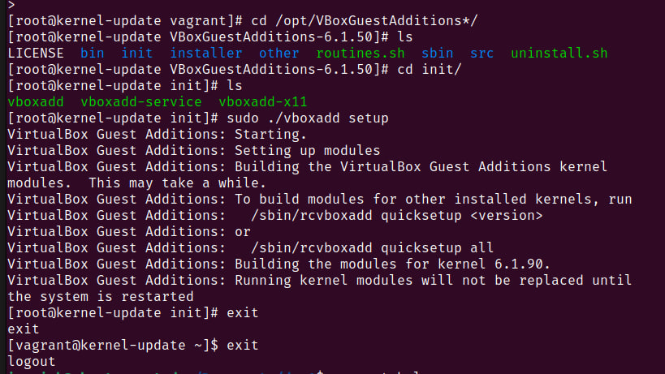
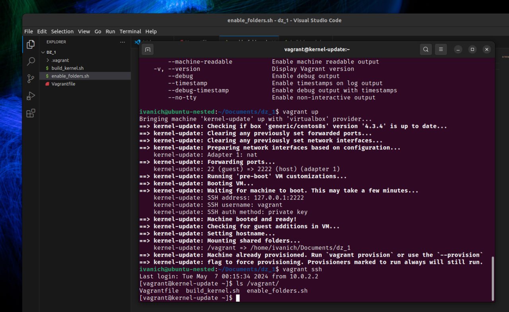

# Домашняя работа по занятию "Vagrant"
Описание домашнего задания
1. Запустить ВМ с помощью Vagrant.
2. Обновить ядро ОС из репозитория ELRepo.
3. Оформить отчет в README-файле в GitHub-репозитории.

Дополнительные задания:
Ядро собрано из исходников
В образе нормально работают VirtualBox Shared Folders

---
- Этап 1: Загружена виртуальная машина из Vagrantfile c ядром 4.18 


- Этап 2: Из репозиториев установлено ядро 6.8.9. Выполнены команды из инструкции 
```bash
sudo yum install -y https://www.elrepo.org/elrepo-release-8.el8.elrepo.noarch.rpm
sudo yum --enablerepo elrepo-kernel install kernel-ml -y
```


- Этап 3: Ядро 6.1.90 собрано из исходинков. Выполненные команды описаны в файле [build_kernel.sh](./build_kernel.sh)


- Этап 4: Подключены VirtualBox Shared Folders. Выполненные команды описаны в файле [enable_folders.sh](./enable_folders.sh)


