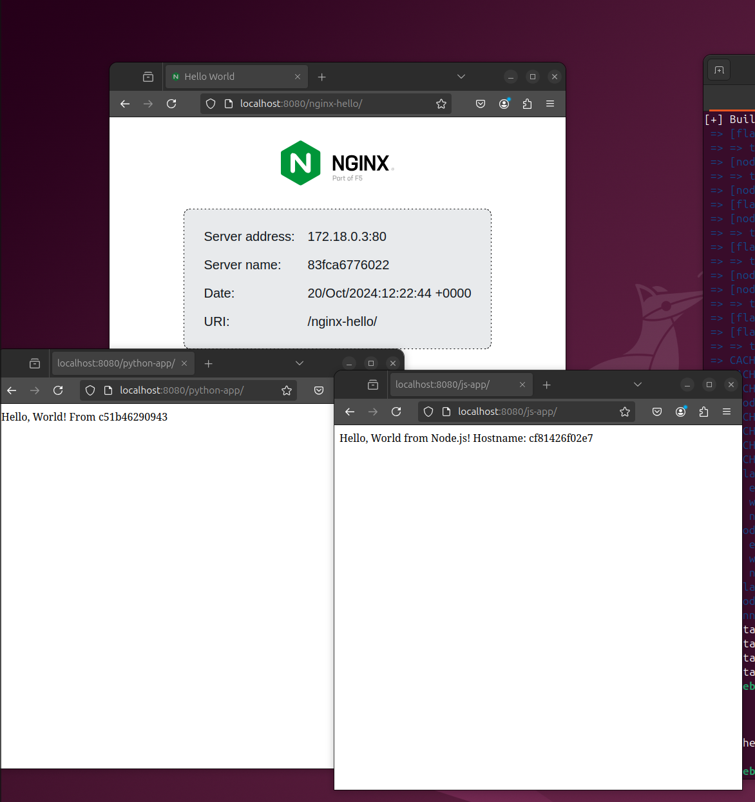

# Динамический Web 
Цель:
Получить практические навыки в настройке инфраструктуры с помощью манифестов и конфигураций;
Отточить навыки использования ansible/vagrant/docker;


Описание/Пошаговая инструкция выполнения домашнего задания:
Для выполнения домашнего задания используйте методичку

Что нужно сделать?

Варианты стенда:

nginx + php-fpm (laravel/wordpress) + python (flask/django) + js(react/angular);
nginx + java (tomcat/jetty/netty) + go + ruby;
можно свои комбинации.

Реализации на выбор:
на хостовой системе через конфиги в /etc;
деплой через docker-compose.

## Выполнение 
Для запуска необходимо 
1. Запустить ВМ в vagrant (с неё на хост машину проброшен порт 8080, на нём работает nginx)

```bash 
vagrant up 
vagrant ssh default
```
2. Переайти в примонтированную директори и запустить docker compose 
```bash
cd /vagrant/
docker compose up -d 
```

По итогу запущено 3 веб приложения, которые достпны через nginx на порту 8080 на роутах 

- `/nginx-hello/`, стандартное приложение nginx, для тестирования балансировки нагрузки
- `/python-app/` - приложение на flask, выводит Hello World и имя хоста
- `/js-app/` - приложение на NodeJs, выводит Hello World и имя хоста

