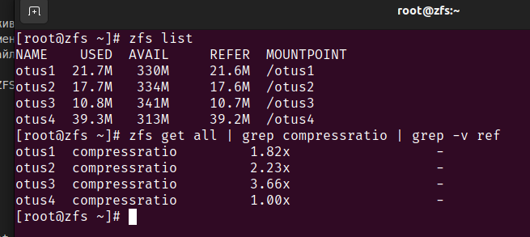

# Домашняя работа по занятию "ZFS"
Описание домашнего задания:
1. Определить алгоритм с наилучшим сжатием:
- Определить какие алгоритмы сжатия поддерживает zfs (gzip, zle, lzjb, lz4);
- создать 4 файловых системы на каждой применить свой алгоритм сжатия;
- для сжатия использовать либо текстовый файл, либо группу файлов.
2. Определить настройки пула.
С помощью команды zfs import собрать pool ZFS.
Командами zfs определить настройки:
- размер хранилища;
- тип pool;
- значение recordsize;
- какое сжатие используется;
- какая контрольная сумма используется.
3. Работа со снапшотами:
скопировать файл из удаленной директории;
восстановить файл локально. zfs receive;
найти зашифрованное сообщение в файле secret_message.

---
1. Определить алгоритм с наилучшим сжатием:
Система запущена, диски видны

Созданы 4 пула 

На пулах включены 4 разных типа компрессии 

Идентичный файл скопирован на все 4 пула 

Определяем коэфицент сжатия, **gzip-9** эффективнее всего 

2. Определить настройки пула

Проверяем настрпойки пула из архива 

Полный вывод статуса по пулу otus 

Выводим отдельно размер, тип, recordsize, тип сжатия и котрольнную сумму

3. Работа со снапшотами 

Импорт снапшота и вывод данных из папки в нём 

Скрипт для сборки пулов записан в [build_repos.sh](./build_zpools.sh) и добавлен в porvision Vagrantfile