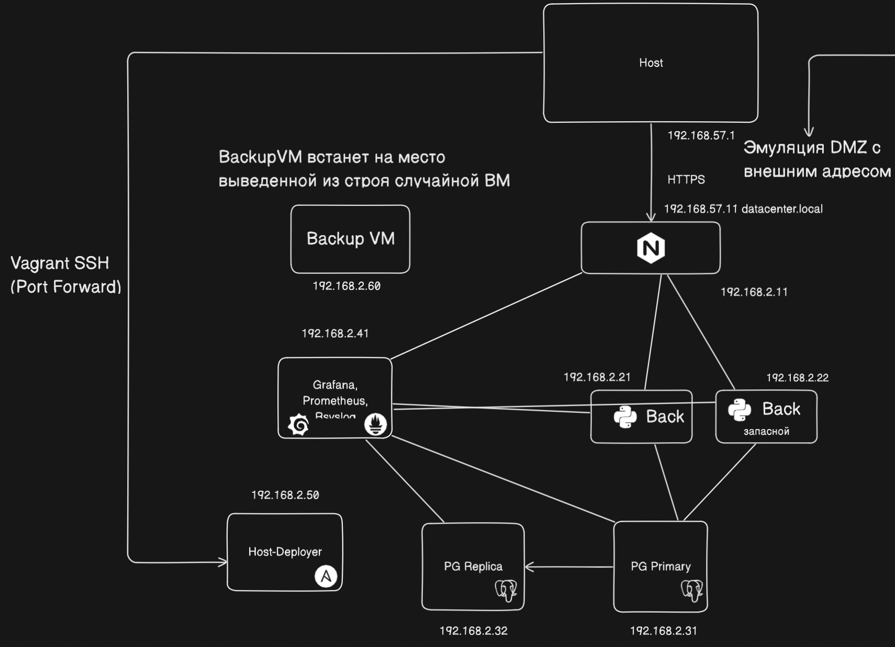
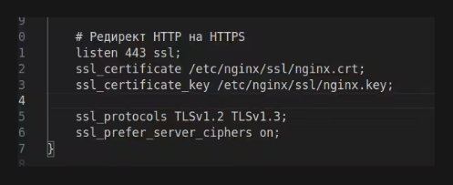
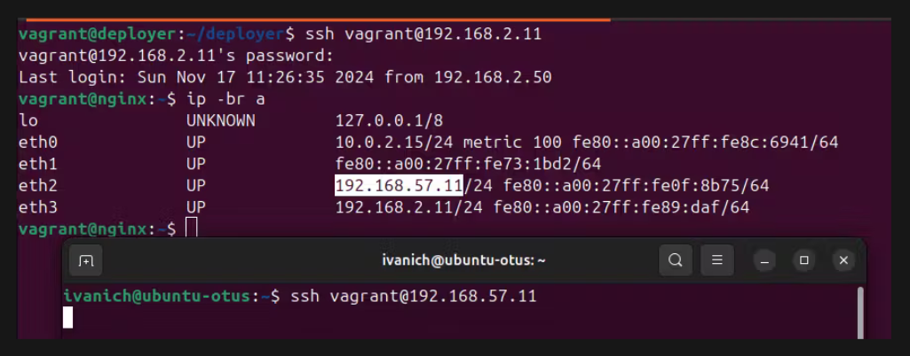
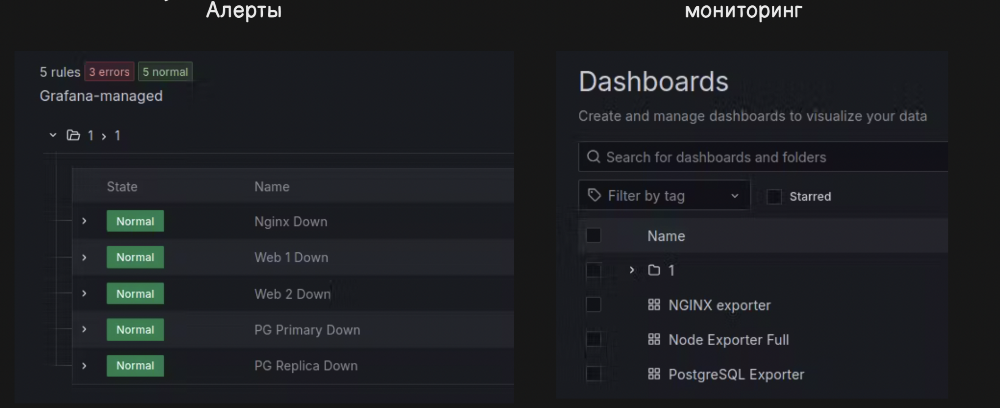
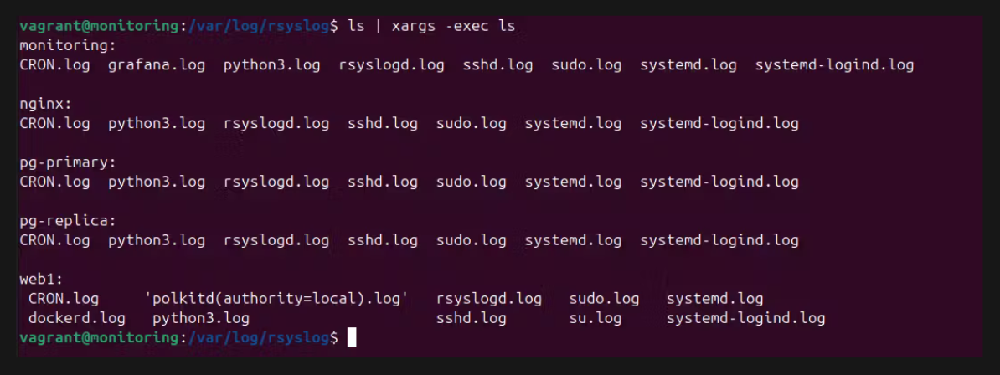
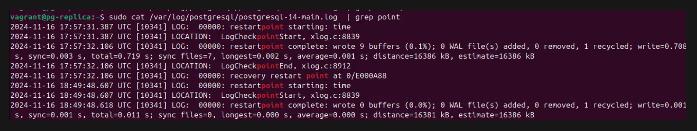

# Project 

### Схема сети 
Виртуальные машины запущены в среде виртуализации Virtualbox с помощью оркестратора [Vagrant](./Vagrantfile)



Предусмотрены 2 сети: 
1. 192.168.57.1/24 - Сеть эмулирующая DMZ (тип: Виртуальный адаптер хоста). В неё включены хостовая машина (192.168.57.1) и ВМ nginx (192.168.57.11). Также в неё добавлена ВМ backup, на случай если ей предется вставать на место nginx c получением соотвествующего IP адреса. На хостовой машине создана hosts запись *datacenter.local*  для адреса nginx, чтобы подключаться к nginx по https. 

2. 192.169.2.1/24 - Внутренняя сеть (тип: Внутреняя сеть). В неё включены все виртуальные машины, доступ с хостовой машины к ним не предоставляется (предлагается что *vagrant ssh* не используется).

Виртуальные машины: 
- [nginx](./deployer/nginx.yml) (192.168.2.11, 192.168.57.11). Развернуты nginx, node-exporter и nginx exporter. Предоставляет доступ к веб приложениям извне с помощью обратного прокси. 
- [web{1,2}](./deployer/web.yml) (192.168.2.21. ; 192.168.2.22). Развернуто веб приложение в docker контейнере и node exporter, на двух экземплярах виртуальных машин. В качестве веб приложения используется [моя курсовая](https://github.com/Ivanich41/database-coursework) (контейнер с БД отключен). ВАЖНО: Приложения балансируются на [nginx](./deployer/nginx/datacenter.conf) в режиме основного и запасного, т.е. запасное не будет получать запросы, пока основное в строю. Это связано с тем что cookie сессии хранятся в памяти самого приложения, а не в отдельной базе, а для балансировки липкой cookie nginx надо собирать из исходников.
- [pg_primary](./deployer/pg_primary.yml) (192.168.2.31). Развернута реляционная БД PostgreSQL, node-exporter и postgres exporter. К ней подключаются экземпляры веб приложения для чтения и записи. 
- [pg_replica](./deployer/pg_replica.yml) (192.168.2.32). Развернута реляционная БД PostgreSQL и node-exporter, ведет репликацию с ноды primary, для пользователя доступна только в режиме read-only. 
- [monitoring](./deployer/monitoring.yml) (192.168.2.41). Развернуты grafana, prometheus, node-exporter и сервер rsyslog. Prometheus получает метрики реального времени от всех экспортеров со всех хостов, а Grafana их отрисовывает, также пристутсвуют базовые алерты в Telegrаm на выход из строя узлов. Сервер rsyslog собирает логи со всех вышеперечисленных вм. 
- deployr (192.168.2.50) Вспомогательная вм, не настраивается через Ansible. Служит для запуска плейбуков настройки для всех остальных ВМ
- backup (192.168.2.61, 192.168.57.12) Предваительно также не настраивается, подготовлена для замены вышедшей из строя ноды. Предполагается замена IP адреса (адресов) на адрес выключенной ВМ.

Ниже описаны детали выаполнения требований для проектной работы:
- Работа https отображена в [конфиге nginx](./deployer/nginx/datacenter.conf) 



- Эмуляция DMZ зоны предусмотрена через первую сеть типа виртуальный адаптер хоста
- Файрвалл на входе реализован, доступны только порты 80 и 443



- Сбор метрик и настроенный алертинг реализованы на ВМ monitoring



- Организован централизированный сбор логов через [сервер rsyslog](./deployer/monitoring/rsyslog.conf)



- Организован backup для всех баз данных [PostgreSQL](./deployer/pg_configs/primary/postgresql.conf) 




## Запуск
```bash 
vagrant up
vagrant ssh deployer 
sudo cp -r /deployer/ /home/vagrant/
cd /home/vagrant/deployer/
ansible-playbook -i hosts.ini pg_primary.yml pg_replica.yml web.yml nginx.yml monitoring.yml send_logs.yml
```


## Настройка вм backup при выводе из строя какой либо другой 

1. Зайти на вм и вначале удалить её стандартный адрес и установить адресс отключенной вм

```bash
vagrant ssh backup 
sudo vim /etc/netplan/50-vagrant.yaml
sudo netplan apply
sudo systemctl restart networking.service
```
В нетплане заменить `192.168.2.60` на ip выведенной из строя вм. Если это nginx то также попправить ip в сети 57. на 57.11

2. Запустить с соотвествующий плейбук настройки
